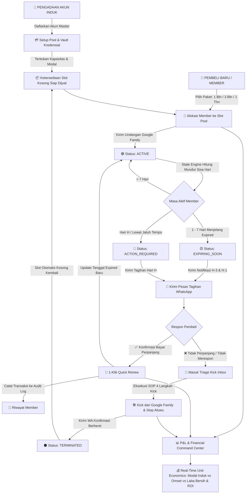
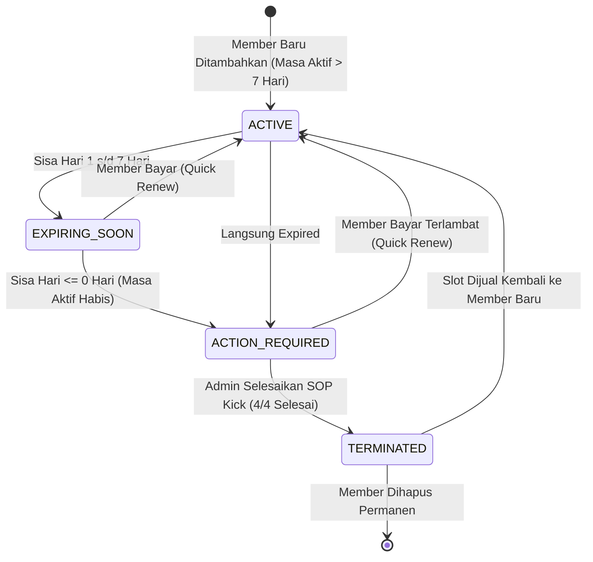
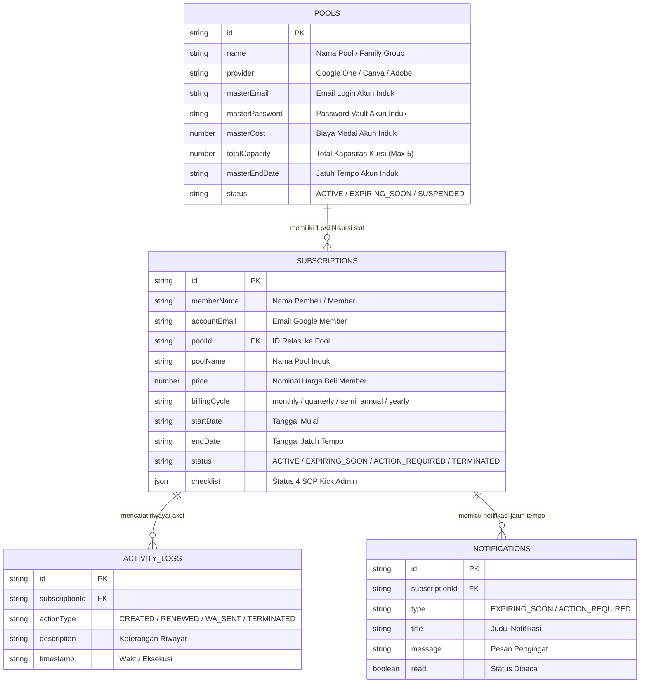

# ⚡ Google One Pro & SubTracker Command Center
### *Sistem Operasi & Manajemen Bisnis Reseller Langganan Digital & Family Sharing Pools*

---

## 📑 Daftar Isi
1. [Konsep Bisnis & Model Kerja Sistem](#-1-konsep-bisnis--model-kerja-sistem)
2. [Diagram Alur Operasional End-to-End (Workflow Lifecycle)](#-2-diagram-alur-operasional-end-to-end)
3. [State Machine Transisi Status Member & Slot](#-3-state-machine-transisi-status-member--slot)
4. [Siklus 7 Tahap Cara Kerja Sistem (Step-by-Step Breakdown)](#-4-siklus-7-tahap-cara-kerja-sistem)
5. [Matematika Finansial & Unit Economics Engine](#-5-matematika-finansial--unit-economics-engine)
6. [Arsitektur Basis Data & Skema Relasional](#-6-arsitektur-basis-data--skema-relasional)
7. [SOP Operasional Admin Playbook](#-7-sop-operasional-admin-playbook)
8. [Roadmap Rekomendasi Fitur Lanjutan](#-8-roadmap-rekomendasi-fitur-lanjutan)
9. [Panduan Instalasi & Menjalankan Aplikasi](#-9-panduan-instalasi--menjalankan-aplikasi)

---

## 🌐 1. Konsep Bisnis & Model Kerja Sistem

Dalam bisnis reseller langganan digital (seperti **Google One Family 2TB/5TB**, **Canva Team**, **Google Workspace**, **Adobe Creative Cloud**, dan **AI Tools**), model bisnis yang digunakan adalah **Multi-Seat Account Pooling**:

```
                                  ┌──────────────────────────────────────────────┐
                                  │           AKUN MASTER (INDUK)                │
                                  │   Google One 5TB Family - Rp 70.000 / thn    │
                                  │      (Kapasitas: 1 Master + 5 Member)        │
                                  └──────────────────────┬───────────────────────┘
                                                         │
               ┌─────────────────────┬───────────────────┼───────────────────┬─────────────────────┐
               ▼                     ▼                   ▼                   ▼                     ▼
        ┌──────────────┐      ┌──────────────┐    ┌──────────────┐    ┌──────────────┐      ┌──────────────┐
        │   SLOT #1    │      │   SLOT #2    │    │   SLOT #3    │    │   SLOT #4    │      │   SLOT #5    │
        │  Member A    │      │  Member B    │    │  Member C    │    │  Member D    │      │  Member E    │
        │ Paket: 3 Bln │      │ Paket: 1 Bln │    │ Paket: 1 Thn │    │ Paket: 1 Bln │      │ Paket: 3 Bln │
        │ Rp 60.000    │      │ Rp 70.000    │    │ Rp 150.000   │    │ Rp 70.000    │      │ Rp 60.000    │
        └──────────────┘      └──────────────┘    └──────────────┘    └──────────────┘      └──────────────┘
```

### ❗ Masalah Utama Pencatatan Manual (Spreadsheet):
1. **Lupa Menghapus Member (Ghost Access)**: Member yang sudah habis masa aktifnya tetap menikmati storage 5TB karena admin lupa menendang (*kick*) dari Google Family.
2. **Keterlambatan Penagihan**: Tagihan dikirim mendadak saat hari H, membuat pembeli enggan memperpanjang.
3. **Kekacauan Perhitungan Modal & Laba**: Sulit menghitung modal tahunan akun induk yang dipecah ke member dengan berbagai siklus paket berbeda (ada yang beli 1 bulan, 3 bulan, atau 1 tahun).
4. **Kehilangan Catatan Password Akun Induk**: Admin lupa email/password akun master saat hendak mengundang member baru.

**Google One Pro & SubTracker** diciptakan sebagai **Sistem Operasi Pusat (Command Center)** yang mengotomatisasi seluruh siklus hidup ini secara presisi dan *real-time*.

---

## 🔄 2. Diagram Alur Operasional End-to-End

Berikut adalah alur lengkap perjalanan operasional bisnis dari pengadaan akun induk hingga kalkulasi laba bersih:



---

## ⚙️ 3. State Machine Transisi Status Member & Slot

Sistem ditenagai oleh **Lifecycle State Engine** yang mengevaluasi selisih tanggal jatuh tempo (`endDate`) terhadap waktu saat ini (`currentDate`) setiap kali aplikasi dimuat:



### Kamus Logika Status:

| Status | Badge UI | Kondisi Hari (`daysLeft`) | Tindakan Sistem & Admin |
| :--- | :--- | :--- | :--- |
| **`ACTIVE`** | 🟢 Hijau | `daysLeft > 7` | Member aktif menikmati layanan. Tidak ada tindakan mendesak. |
| **`EXPIRING_SOON`** | 🟡 Kuning | `0 < daysLeft <= 7` | Masuk ke antrean pengingat. Tombol kirim WA tagihan disorot. |
| **`ACTION_REQUIRED`** | 🔴 Merah | `daysLeft <= 0` | Masa aktif habis! Masuk ke **Kick Action Inbox**. Wajib ditagih atau di-kick dari Family. |
| **`TERMINATED`** | ⚫ Abu-abu | Status manual setelah kick | Akses member telah diputus. Slot pada pool terkait dirilis menjadi kosong (*available*). |

---

## 🚀 4. Siklus 7 Tahap Cara Kerja Sistem (Step-by-Step Breakdown)

### 🔹 Tahap 1: Pengadaan & Registrasi Akun Master Pool
1. Admin membeli akun master Google One (misal: 5TB kapasitas 5 member seharga Rp 70.000/thn).
2. Admin membuka tab **Pool & Akun Induk** ➔ Klik **`+ Tambah Pool Baru`**.
3. Admin memasukkan:
   - **Email Akun Induk Master** (misal: `husnidrsae@gmail.com`).
   - Sistem secara cerdas melakukan **Auto-Naming**: `Google One 5TB Family - husnidrsae`.
   - **Password Akun Induk** (disimpan aman di vault lokal untuk memudahkan saat login admin console).
   - **Total Kapasitas Kursi**: 5 slot.
   - **Biaya Modal Pembelian Akun Induk**: Rp 70.000.
   - **Tanggal Jatuh Tempo Akun Induk**.

### 🔹 Tahap 2: Onboarding & Alokasi Slot Member
1. Pembeli baru memesan slot langganan (misal: paket 3 Bulan seharga Rp 60.000).
2. Admin membuka tab **Member Slots** ➔ Klik **`+ Tambah Member Baru`**.
3. Admin mengisi:
   - Nama Pembeli & Email Google pembeli.
   - Pilih Pool Induk yang masih memiliki kursi kosong (`Google One 5TB Family - husnidrsae`).
   - Pilih Durasi Paket: **3 Bulan (Quarterly)** dengan harga Rp 60.000.
   - Sistem otomatis menghitung tanggal jatuh tempo: `Hari Ini + 3 Bulan`.
4. Admin mengundang email pembeli ke Google Family Group dan status member menjadi **`ACTIVE`**.

### 🔹 Tahap 3: Real-Time Lifecycle Monitoring & Audit Trail
1. Sistem menghitung sisa hari setiap member secara real-time.
2. Setiap perubahan status, perpanjangan, atau tindakan admin dicatat ke dalam **Audit Trail & Activity Log** khusus member tersebut.
3. Admin dapat mengklik **`Riwayat ▾`** pada kartu member untuk melihat seluruh linimasa riwayat interaksi dan perpanjangan member.

### 🔹 Tahap 4: Pengingat & Penagihan Multi-Channel
1. Saat member memasuki H-3 hingga Hari H (`EXPIRING_SOON` / `ACTION_REQUIRED`):
2. Admin mengklik ikon **💬 WhatsApp**:
   - Sistem merender pesan tagihan personal lengkap dengan nama member, nama layanan, nominal paket, dan tanggal jatuh tempo.
   - 1-klik membuka WhatsApp Web / WhatsApp Desktop langsung ke kontak member.
3. Integrasi **Google Calendar**: Admin dapat menyinkronkan jadwal jatuh tempo ke kalender via iCal Feed URL atau tombol `+ Google Calendar`.

### 🔹 Tahap 5: Perpanjangan Cepat (Quick Renew Flow)
1. Jika member membayar perpanjangan:
2. Admin mengklik tombol **🔄 Quick Renew**:
   - Pilih durasi perpanjangan (+1 Bulan, +3 Bulan, +6 Bulan, +1 Tahun).
   - Sistem otomatis memajukan tanggal `endDate` dari tanggal jatuh tempo sebelumnya.
   - Status otomatis kembali normal menjadi **`ACTIVE`**.
   - Transaksi perpanjangan otomatis tercatat ke riwayat log aktivitas.

### 🔹 Tahap 6: SOP Kick Action & Slot Triage Inbox
1. Jika member tidak merespon / tidak memperpanjang:
2. Member otomatis muncul di halaman utama **Kick Action & Slot Triage Inbox**.
3. Admin dipandu menyelesaikan **4 Langkah SOP Wajib**:
   - [x] **Langkah 1**: Buka Google Family / Admin Console ➔ Keluarkan email member dari grup family.
   - [x] **Langkah 2**: Putus akses storage & sinkronisasi cloud member.
   - [x] **Langkah 3**: Kirim pesan konfirmasi penghentian layanan via WhatsApp.
   - [x] **Langkah 4**: Konfirmasi kick selesai ➔ Status member menjadi `TERMINATED`.
4. Kursi pada akun induk otomatis bertambah 1 slot kosong dan siap dijual kembali ke pembeli baru.

### 🔹 Tahap 7: P&L Financial Command Center & Unit Economics
1. Admin membuka tab **Analytics**:
2. Sistem mempertemukan seluruh modal pembelian akun master vs seluruh kas iuran yang dibayar member.
3. Admin dapat menganalisis keuntungan bisnis secara menyeluruh dan detail per masing-masing grup pool.

---

## 💰 5. Matematika Finansial & Unit Economics Engine

Aplikasi menggunakan formula presisi untuk menghitung kesehatan finansial bisnis reseller:

```
┌────────────────────────────────────────────────────────────────────────────────────────┐
│                                FORMULA FINANSIAL UTAMA                                │
├────────────────────────────────────────────────────────────────────────────────────────┤
│ 1. Total Modal Seluruh Akun Induk (COGS) = ∑ (pool.masterCost)                         │
│ 2. Total Kas Omset Member Masuk          = ∑ (active_member.price)                     │
│ 3. Laba Bersih Riil (Net Profit)         = Total Kas Omset - Total Modal Akun Induk    │
│ 4. Margin Keuntungan (%)                 = (Laba Bersih ÷ Total Kas Omset) × 100%      │
│ 5. Return on Investment (ROI Multiplier) = Total Kas Omset ÷ Total Modal Akun Induk    │
└────────────────────────────────────────────────────────────────────────────────────────┘
```

### 3 Mode Tampilan Analisis:
1. **Total Riil (Aktual)** *(Default)*:
   - Menghitung modal riil yang dikeluarkan untuk membeli seluruh akun master pool vs seluruh iuran yang dibayarkan oleh member aktif (baik yang bayar 1 bln, 3 bln, maupun 1 thn).
2. **Rata-rata Bulanan (MRR / Monthly Run-Rate)**:
   - Menormalkan seluruh paket ke basis 30 hari:
     - Paket Tahunan ÷ 12
     - Paket 3 Bulan ÷ 3
     - Paket 6 Bulan ÷ 6
     - Biaya Master Bulanan = Total Modal Master ÷ 12
3. **Proyeksi 1 Tahun (ARR / Annual Run-Rate)**:
   - Mengalikan rata-rata bulanan menjadi proyeksi perputaran 12 bulan penuh.

---

## 🗄️ 6. Arsitektur Basis Data & Skema Relasional

Sistem mengadopsi arsitektur **Local-First Database** berbasis **Dexie.js (IndexedDB)** di sisi browser dan siap disinkronkan dengan **Supabase PostgreSQL**:



---

## 📋 7. SOP Operasional Admin Playbook

### 🟢 SOP A: Menerima Member Baru
1. Pastikan ada pool yang memiliki sisa slot kosong di tab **Pool & Akun Induk**.
2. Masuk ke tab **Member Slots** ➔ Klik **`+ Tambah Member`**.
3. Masukkan data member dan pilih pool tujuan.
4. Salin email member ➔ Buka Google Family Admin Console ➔ Kirim undangan join family.
5. Kirim format pesan selamat datang via WhatsApp.

### 🟡 SOP B: Penanganan Member H-3 (Jatuh Tempo)
1. Buka tab **Member Slots** atau filter status **Jatuh Tempo**.
2. Klik tombol **💬 WhatsApp** pada kartu member.
3. Periksa nominal tagihan pada template pesan ➔ Kirim ke pembeli.

### 🔴 SOP C: Eksekusi Kick Member (Masa Aktif Habis)
1. Buka halaman utama **Kick Action & Slot Triage Inbox**.
2. Klik tombol **`Tindakan Kick (0/4)`** pada kartu member yang merah:
   - Centang [1] Hapus akun dari Google Family Group.
   - Centang [2] Putus akses storage 5TB.
   - Centang [3] Kirim WA konfirmasi pelepasan akses.
   - Centang [4] Konfirmasi slot kosong.
3. Klik **`Selesaikan & Kosongkan Slot`**.
4. Slot kini otomatis siap dijual kembali di pasar.

### 💾 SOP D: Backup & Restore Data
1. Klik tombol **⚙️ / Export Data** pada header atas.
2. Klik **`Download Backup (.json)`** secara berkala (disarankan setiap minggu).
3. File JSON dapat di-import kembali kapan saja di perangkat baru tanpa kehilangan riwayat data.

---

## 🔮 8. Roadmap Rekomendasi Fitur Lanjutan

1. **Smart Slot Relocation & Disaster Recovery (1-Click Pool Migration)**:
   - Fitur 1-klik untuk memindahkan seluruh member dari Pool A ke Pool Cadangan B secara otomatis jika akun induk terkena limit/suspend.
2. **Otomasi WhatsApp Webhook / Gateway (Wablas / Fonnte / Baileys)**:
   - Bot otomatis mengirim pengingat di latar belakang pada H-3, H-1, dan Hari H.
3. **Customer Self-Service Portal**:
   - Link mandiri bagi pembeli (`domain.com/cek?id=xxx`) untuk mengecek sisa hari aktif dan konfirmasi perpanjangan tanpa harus chat CS.
4. **Integrasi Auto-QRIS & Payment Gateway (Midtrans / Tripay)**:
   - Pembeli scan QRIS ➔ Sistem otomatis memverifikasi mutasi dan memperpanjang masa aktif member secara instan.
5. **Export Laporan Pembukuan PDF & Excel (.xlsx)**:
   - Download rekap keuangan bulanan untuk pembukuan pajak dan rekap laba rugi.
6. **Role-Based Access Control (RBAC)**:
   - Pembatasan akun CS: hanya bisa melihat slot & kirim WA tanpa bisa melihat password master atau profit owner.

---

## 💻 9. Panduan Instalasi & Menjalankan Aplikasi

### Kebutuhan Sistem:
- **Node.js**: v18.18.0 atau lebih baru
- **NPM** / **Yarn** / **PNPM** / **Bun**

### Langkah Instalasi:
```bash
# 1. Clone repository
git clone https://github.com/username/google-one-pro.git

# 2. Masuk ke direktori proyek
cd "Google One Pro"

# 3. Install dependencies
npm install

# 4. Jalankan development server
npm run dev -- -p 3000
```

Buka [http://localhost:3000](http://localhost:3000) di browser Anda untuk mulai mengoperasikan Command Center.

---

## 📄 Lisensi
Didistribusikan di bawah lisensi resmi **MIT License**.
