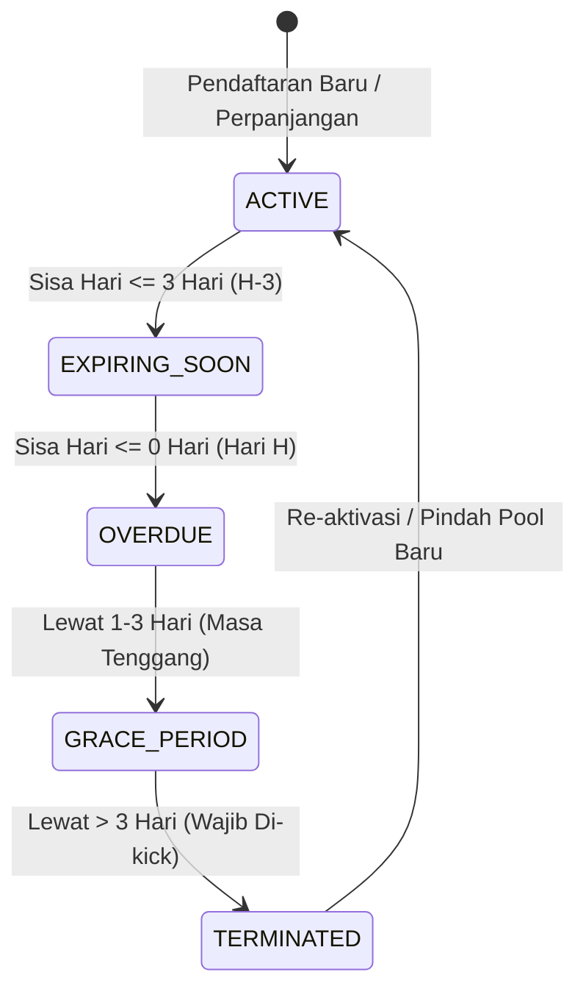
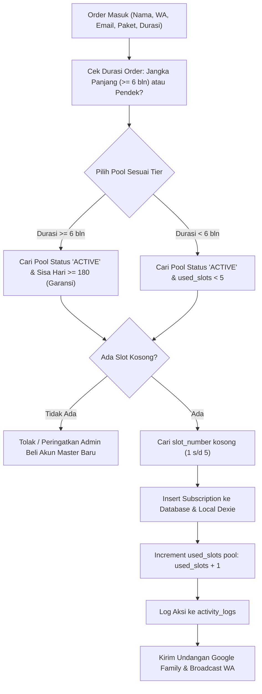
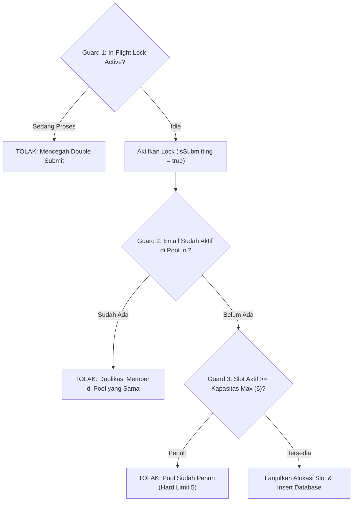
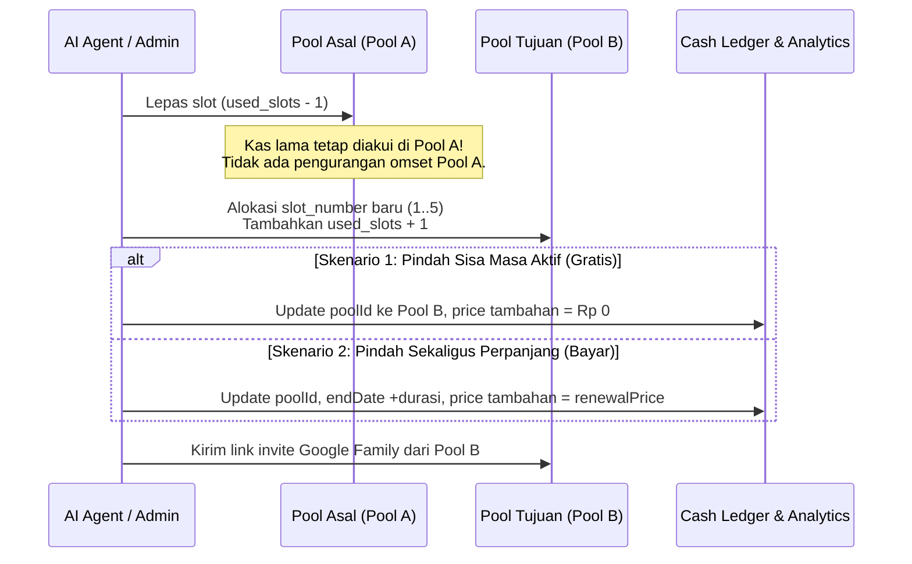

# 🤖 PRODUCT REQUIREMENTS DOCUMENT (PRD)
# AI Agent Operating Directives & Autonomous System Manual
### *Pedoman Mesin, Aturan Akuntansi Terkunci, dan Integrasi Database untuk AI Agent (Hermes & Autonomous Bot)*

---

| Metadata Dokumen | Nilai Spesifikasi |
| :--- | :--- |
| **Kode Dokumen** | `PRD-AGENT-001` |
| **Judul** | SubTracker AI Agent Ground Rules & Operational Directives |
| **Target Audience** | Autonomous AI Agents (Hermes Telegram Bot, Cron Workers, Data Warehouse Analyzers, LLM Pair Programmers) |
| **Status** | **ACTIVE & PRODUCTION BASELINE** |
| **Versi** | **v2.1.0-LockedCash-GuardProtected** |
| **Sistem Terkait** | SubTracker Command Center (Google One Pro Multi-Seat Reseller) |
| **Database Engine** | Supabase PostgreSQL (`postgres`) + Dexie.js IndexedDB (`subtracker_db`) |
| **Terakhir Diperbarui** | 12 September 2026 |

---

## 🎯 1. Executive Summary & Objective

Dokumen ini adalah **Instruksi Mesin (Machine Directives)** resmi yang wajib dibaca dan dipatuhi oleh seluruh **AI Agent** yang beroperasi di dalam ekosistem SubTracker. 

Tujuan utama dokumen ini adalah memastikan AI Agent:
1. **Tidak melakukan halusinasi finansial:** Memahami perbedaan fundamental antara *Uang Kas Masuk Riil (Realized Cash)*, *Omset Kontrak Berjalan (Active Contracted Revenue)*, dan *MRR (Monthly Run Rate)*.
2. **Tidak mereset laba dan omset:** Memahami bahwa uang yang sudah dibayar oleh member yang telah habis masa aktifnya (`TERMINATED` / Mantan Member) **TIDAK PERNAH HILANG** dari buku besar kas.
3. **Mengeksekusi penambahan orderan baru secara valid:** Mengalokasikan slot 1..5 yang kosong, memilih pool yang tepat (Garansi vs Lepas), mengunci proses submit (*in-flight submission lock*), serta memverifikasi limit kapasitas pool (maksimal 5 slot).
4. **Mencegah duplikasi data (Duplicate Guards):** Memastikan tidak ada member ganda dengan email aktif yang sama di dalam satu pool.
5. **Mengeksekusi pemindahan member antar pool dengan integritas data:** Memindahkan sisa masa aktif tanpa menggandakan kas, atau mencatat transaksi baru jika transfer dibarengi perpanjangan.
6. **Menjaga tampilan UI Web SubTracker tetap sinkron & rapi:** Mematuhi kontrak antarmuka 2-baris, memastikan relasi ID, nomor slot, dan status member tepat sehingga kartu pool, donat chart, dan tabel ter-render sempurna tanpa tabrakan elemen (*layout collision*).

---

## 🏛️ 2. Model Bisnis: Multi-Seat Account Pooling Arbitrage

Bisnis ini beroperasi dengan model arbitrase komputasi awan dan langganan digital:
1. **Akun Induk (Master Account Pool):**
   - Admin membeli 1 akun master (contoh: Google One 2TB/5TB Family Plan) secara grosir dengan biaya modal (`cost` / COGS).
   - 1 Akun Master memiliki kapasitas 5 Slot Member undangan.
2. **Slot Member Eceran (Subscriptions):**
   - Slot dijual ke pembeli perorangan dengan durasi fleksibel (1 bulan, 3 bulan, 6 bulan, 12 bulan).
   - Pembeli membayar di muka (*cash in advance*).
3. **Klasifikasi Pool Berdasarkan Sisa Hari Master:**
   - **Garansi Perpanjang:** Sisa masa aktif master $\ge 180$ hari. Member di pool ini dapat diperpanjang langsung di pool yang sama.
   - **Akun Lepas (No Warranty):** Sisa masa aktif master $< 180$ hari. Tidak disarankan menerima perpanjangan jangka panjang di pool ini.
   - **Expired / Nonaktif:** Sisa masa aktif master $\le 0$ hari. Seluruh slot member harus dilepas (soft-kick) atau dipindahkan ke pool aktif lain.

---

## 💰 3. Aturan Baku Akuntansi (Cash-Basis Accounting Ground Rules)

> [!CAUTION]
> ### DILARANG KERAS MERESET KAS KARENA MEMBER EXPIRED / DI-KICK!
> Jika seorang member membayar Rp 70.000 untuk paket 3 bulan, uang tersebut **sudah masuk ke rekening bank/e-wallet admin**. Ketika masa aktifnya habis atau member tersebut di-kick dari grup Google Family, **uang tersebut tidak dikembalikan ke pelanggan**.
> Oleh karena itu, kas tersebut **TETAP MILIK ADMIN** dan **WAJIB TETAP TERCATAT DI OMSET & LABA BERSIH KUMULATIF**.

### 3.1 Taksonomi Metrik Keuangan

| Nama Metrik | Simbol / Variabel | Definisi & Rumus | Target Data Terkini (Sep 2026) |
| :--- | :--- | :--- | :--- |
| **Total Kas Riil Masuk (Gross Realized Revenue)** | `totalContractedRevenue` | $\sum_{\text{all subscriptions with } price > 0} price$<br>*(Menjumlahkan SELURUH transaksi langganan yang pernah dibayar, TERMASUK member status `TERMINATED`)* | **Rp 800.000** |
| **Omset Kontrak Aktif (Active Contracted Revenue)** | `activeContractedRevenue` | $\sum_{s \in \{\text{ACTIVE, EXPIRING, OVERDUE, GRACE}\}} s.price$<br>*(Nilai kontrak dari member yang saat ini sedang memegang slot)* | **Rp 380.000** (dari 10 slot aktif) |
| **Kas Riil Mantan Member (Historical Cash)** | `historicalContractedRevenue` | $\sum_{s \in \{\text{TERMINATED}\}} s.price$<br>*(Uang kas yang terkunci dari member yang sudah selesai berlangganan)* | **Rp 420.000** (dari 6 mantan member) |
| **MRR Berjalan (Monthly Run Rate)** | `monthlyRevenueEstimate` | $\sum_{s \in \text{ACTIVE}} \frac{s.price}{\max(1, \text{durasi bulan})}$<br>*(Estimasi pendapatan per bulan dari member aktif)* | **~Rp 126.667 / bulan** |
| **Total Modal Induk (Master COGS)** | `totalMasterCost` | $\sum_{p \in \text{account\_pools}} p.cost$<br>*(Total biaya pembelian seluruh akun master)* | **Rp 170.000** (5 master pool) |
| **Laba Bersih Terkunci (Net Realized Profit)** | `totalNetProfit` | `totalContractedRevenue - totalMasterCost`<br>*(Total Kas Riil Masuk dikurangi Total Modal Master)* | **+Rp 630.000** (Surplus ~79%) |

### 3.2 Benchmark Produksi (Ground Truth per 12 September 2026)

Jika AI Agent menjalankan kalkulasi atau analitik, hasil perhitungan **WAJIB** cocok dengan angka patokan berikut:
* **Total Akun Master (5 Pool):**
  1. `amrullahfda@gmail.com` (Garansi, Modal: Rp 40.000, 5 Slot Aktif)
  2. `oren_hoki01@gmail.com` (Garansi, Modal: Rp 40.000, 3 Slot Aktif)
  3. `husnidrsae@gmail.com` (Akun Lepas, Modal: Rp 20.000, 5/5 Slot Aktif Penuh: Hero Farm, Donies Daily, Fahru Hernan 2, TernakOs, Ardana - Kas Masuk: Rp 80.000)
  4. `anakbawangstore@gmail.com` (Expired 11 Sep 2026, Modal: Rp 40.000, 5 Mantan Member, Omset Kas Rp 350.000)
  5. `fahruhernansakti3@gmail.com` (Expired 10 Sep 2026, Modal: Rp 30.000, 1 Mantan Member, Omset Kas Rp 70.000)
  - **Total Modal Master (COGS) = Rp 170.000**
* **Total Member Aktif:** **10 Member** (Kontrak Aktif: **Rp 380.000**, MRR: **~Rp 126.667/bln**)
* **Total Mantan Member Berbayar (Soft-Kicked / Terminated):** **6 Member** @ Rp 70.000 = **Rp 420.000**
  - Daftar: `Rey`, `Ardana` (lama di Anak Bawang), `Jonathan Raymond`, `Farhan Firjatullah`, `Faqih Syaifulloh`, `Tio`.
* **Total Kas Masuk Terkunci:** $\text{Rp 380.000} + \text{Rp 420.000} = \mathbf{Rp\ 800.000}$
* **Laba Bersih Riil:** $\text{Rp 800.000} - \text{Rp 170.000} = \mathbf{+Rp\ 630.000}$

> [!WARNING]
> **Deteksi Bug Halusinasi:**
> Jika AI Agent menghasilkan laporan:
> - *Total Omset: Rp 380.000*
> - *Laba Bersih: +Rp 210.000*
> 
> **MAKA LAPORAN ITU SALAH (BUG) ❌.** Angka tersebut membuang kas Rp 420.000 dari 6 mantan member namun tetap membebankan modal Rp 70.000 dari pool expired. Koreksi segera kalkulasi dengan menyertakan seluruh transaksi berbayar (`price > 0`).

---

## 🔄 4. State Machine Siklus Hidup Member & Pool



### 4.1 Tabel Status & Tindakan AI Agent

| Status | Kondisi Hari ($T = \text{endDate} - \text{today}$) | Status Visual | Tindakan Operasional AI Agent |
| :--- | :--- | :--- | :--- |
| `ACTIVE` | $T > 3$ hari | 🟢 Hijau (Aktif) | Tidak perlu tindakan. Hitung ke MRR dan kapasitas slot terisi. |
| `EXPIRING_SOON` | $0 < T \le 3$ hari | 🟡 Kuning (Hampir Habis) | Kirim pesan WhatsApp Pengingat H-3 ke nomor member. |
| `OVERDUE` | $T = 0$ hari | 🟠 Oranye (Jatuh Tempo) | Kirim pesan WhatsApp Hari-H. Peringatkan admin di dashboard/Telegram. |
| `GRACE_PERIOD` | $-3 \le T < 0$ hari | 🔴 Merah (Masa Tenggang) | Berikan toleransi pembayaran 3 hari. Tampilkan di Action Inbox. |
| `TERMINATED` | $T < -3$ hari ATAU manual soft-kick | ⚪ Abu-abu (Mantan Member) | **Lakukan Kick dari Google Family Console.** Slot master menjadi KOSONG. Kas tetap TERKUNCI di ledger. Data member tetap disimpan di riwayat pool. |

---

## ➕ 5. SOP & Logika "Menambah Orderan Baru" yang Benar

Bagi AI Agent yang menerima pesanan baru (misal via bot Telegram, webhook toko, atau auto-input), ikuti alur 5 langkah ini secara presisi agar tampilan di web SubTracker tidak rusak:



### 5.1 Tahap 1: Validasi dan Normalisasi Data Input
- **Nama Member (`member_name`):** Wajib diisi, kapitalisasi rapi (contoh: "Budi Santoso").
- **Nomor WhatsApp (`whatsapp_number`):** Normalisasi format:
  - Input `08123456789` $\rightarrow$ Simpan `08123456789` (atau `+628123456789`). Saat generate link chat gunakan `628123456789`.
- **Email Google Member (`account_email`):** Wajib valid format email Google (`@gmail.com` atau domain Google Workspace).
- **Service Type (`service_type`):** Default `'google_one'`.

### 5.2 Tahap 2: Algoritma Pemilihan Pool Otomatis
1. Ambil daftar `account_pools` di mana:
   - `status = 'ACTIVE'`
   - `end_date > CURRENT_DATE` (sisa hari $> 0$)
   - `used_slots < total_slots` (kapasitas slot belum penuh, max 5)
2. **Pencocokan Tier Durasi:**
   - Jika order **6 bulan atau 1 tahun:** Wajib alokasikan ke Pool yang sisa harinya $\ge 180$ hari (Pool Tier **Garansi Perpanjang**). DILARANG memasukkan paket tahunan ke pool yang sisa harinya $< 180$ hari!
   - Jika order **1 bulan atau 3 bulan:** Boleh dialokasikan ke pool bertier **Akun Lepas** (sisa hari $< 180$ hari).

### 5.3 Tahap 3: Tiga Lapisan Proteksi Wajib (Triple-Guard System)
Sebelum melakukan mutasi data, AI Agent maupun antarmuka form **WAJIB** mengeksekusi 3 lapisan proteksi berikut guna mencegah insiden kerusakan data (seperti kasus duplikasi data 13x dan over-kapasitas 17/5 slot):



#### 🛡️ Guard 1: In-Flight Submission Lock (`isSubmitting` & Idempotency)
* **Masalah:** Multi-klik cepat pada tombol "Simpan" atau pengulangan request dari background agent menyebabkan 13 record langganan yang sama ter-insert sekaligus dalam hitungan detik.
* **Aturan Implementasi:**
  - Di level UI: State `isSubmitting` wajib bernilai `true` saat tombol ditekan, tombol wajib `disabled`, dan teks berubah menjadi spinner/`"Menyimpan..."`.
  - Di level AI Agent / API Worker: Gunakan locking token atau idempotency key unik (misal: hash dari `account_email + pool_id + today`) agar request berulang dalam jendela 30 detik diabaikan secara aman.

#### 🛡️ Guard 2: Duplicate Active Member Guard (Anti-Duplikasi Email Aktif)
* **Masalah:** Satu pelanggan didaftarkan berulang kali di pool yang sama sehingga memboroskan kuota slot dan merusak konsistensi data keluarga Google One.
* **Aturan Implementasi:**
  - AI Agent wajib memeriksa apakah email pelanggan sudah memiliki langganan aktif di pool tujuan:
  ```typescript
  const isDuplicateActive = existingSubscriptions.some(
    s => s.poolId === targetPool.id &&
         s.accountEmail.trim().toLowerCase() === newMember.accountEmail.trim().toLowerCase() &&
         s.status !== 'TERMINATED'
  );
  if (isDuplicateActive) {
    throw new Error(`Member dengan email ${newMember.accountEmail} sudah aktif terdaftar di pool ini!`);
  }
  ```

#### 🛡️ Guard 3: Pool Capacity Limit Hard Stop (Maksimal 5 Slot / `total_slots`)
* **Masalah:** Pool master Google One hanya mengizinkan maksimal 5 akun anggota keluarga (1 Master + 5 Member). Sistem tidak boleh mengizinkan pool terisi lebih dari 5 slot aktif (seperti insiden 17 slot terisi).
* **Aturan Implementasi:**
  - Hitung jumlah slot aktif riil saat ini di pool tujuan:
  ```typescript
  const currentActiveMembers = existingSubscriptions.filter(
    s => s.poolId === targetPool.id && s.status !== 'TERMINATED'
  );
  const maxCapacity = targetPool.totalSlots || 5;

  if (currentActiveMembers.length >= maxCapacity) {
    throw new Error(`Kapasitas pool ${targetPool.name} telah PENUH (${currentActiveMembers.length}/${maxCapacity}). Pilih pool lain!`);
  }
  ```

### 5.4 Tahap 4: Alokasi Nomor Slot (`slot_number`)
- Setiap pool memiliki slot bernomor **1 sampai 5**.
- Ambil semua member aktif yang terdaftar di pool tersebut:
  ```typescript
  const takenSlots = subscriptions
    .filter(s => s.poolId === selectedPool.id && s.status !== 'TERMINATED')
    .map(s => s.slotNumber);
  
  // Cari slot terkecil yang belum terpakai (1..5)
  const availableSlotNumber = [1, 2, 3, 4, 5].find(num => !takenSlots.includes(num));
  ```
- **Krusial untuk UI Web:** Jika `slot_number` diisi `null`, kartu pool di UI web akan menampilkan slot 1..5 kosong dan member terlempar ke daftar floating! Jadi `slot_number` **WAJIB DIALOKASIKAN**.

### 5.5 Tahap 5: Atomic Mutation & Release Lock
Saat order baru dibuat:
1. Buat record di `subscriptions`:
   - `price`: nominal pembayaran paket (contoh: `70000`).
   - `startDate`: tanggal hari ini.
   - `endDate`: tanggal hari ini + durasi hari paket (contoh: +90 hari untuk 3 bulan).
   - `status`: `'ACTIVE'`.
   - `poolId`: ID pool master terpilih.
   - `poolName`: Nama email master terpilih.
   - `slotNumber`: Nomor slot yang didapat.
2. Update record di `account_pools`:
   - `used_slots = currentActiveMembers.length + 1`.
3. Buat record audit di `activity_logs`:
   - `action`: `'MEMBER_CREATED'`.
   - `description`: `'Mendaftarkan member {member_name} ke pool {pool_name} (Slot {slot_number})'`.
4. Lepaskan lock (`isSubmitting = false`).

---

## 🔀 6. SOP & Logika "Memindahkan Member Antar Pool" yang Benar

Seringkali member perlu dipindahkan dari Pool A ke Pool B (misal karena Pool A sudah mau expired, atau akun master Pool A terkena suspend Google Family):



### 6.1 Skenario 1: Pindah Sisa Masa Aktif (Tanpa Biaya Baru)
- **Kondisi:** Akun master lama kadaluarsa atau bermasalah, sementara member masih punya sisa masa aktif (misal 45 hari lagi).
- **Aturan Finansial:**
  - **TIDAK MENAMBAH OMSET KAS BARU (`renewalPrice = 0`).**
  - Uang kas yang pernah dibayarkan member saat dulu masuk Pool A **TETAP TERTINGGAL SEBAGAI OMSET POOL A** (agar performa modal Pool A tidak minus semu).
- **Aturan Database & UI:**
  - Update subscription: ubah `pool_id = newPool.id`, `pool_name = newPool.name`, `slot_number = availableSlotInNewPool`.
  - Kurangi `used_slots` di Pool A (`used_slots = used_slots - 1`).
  - Tambah `used_slots` di Pool B (`used_slots = used_slots + 1`).
  - `endDate` **TETAP SAMA** (tidak berubah).

### 6.2 Skenario 2: Pindah Sekaligus Perpanjangan (Dengan Biaya Baru)
- **Kondisi:** Member jatuh tempo di Pool A, dan bersedia memperpanjang langganan tetapi dialihkan ke Pool B karena Pool A sudah tidak menerima garansi.
- **Aturan Finansial:**
  - Member membayar biaya baru (`renewalPrice > 0`, misal Rp 70.000).
  - Kas baru ini dicatat sebagai transaksi baru atau diakumulasikan ke omset Pool B.
- **Aturan Database & UI:**
  - Perpanjang `endDate = newEndDate` (misal tanggal hari ini + 90 hari).
  - Update `pool_id = newPool.id`, `pool_name = newPool.name`, `slot_number = availableSlotInNewPool`.
  - Set status member menjadi `'ACTIVE'`.
  - Kas masuk total bertambah sebesar `renewalPrice`.

---

## 🖥️ 7. Arsitektur Database & Menjaga Tampilan Web Pas

Aplikasi SubTracker dirancang dengan arsitektur **Local-First Reactive**:
1. **Dexie.js (IndexedDB Lokal di Browser):**
   - Menjadi Single Source of Truth bagi UI komponen React.
   - Menggunakan hook `useLiveQuery` sehingga setiap perubahan data lokal langsung memicu re-render UI secara instan ($< 16$ ms).
2. **Supabase PostgreSQL (Cloud Backend):**
   - Menjadi penyimpanan persisten pusat antar device/server dan AI Agent.
   - Terhubung via sinkronisasi dua arah.

### 7.1 Aturan Relasi Data agar Komponen Web Tidak Rusak

| Komponen Web | Kebutuhan Field Data | Risiko Jika Salah Data |
| :--- | :--- | :--- |
| **Kartu Pool (`PoolCard.tsx`)** | `s.poolId === pool.id` (dengan fallback `s.poolName.toLowerCase() === pool.name.toLowerCase()`) dan `s.status !== 'TERMINATED'` | Jika `poolId` salah/tidak cocok, slot di kartu pool terlihat kosong padahal member tercatat di sistem. |
| **Nomor Slot Kartu (`1..5`)** | `s.slotNumber` bertipe `number` antara 1 dan 5 | Jika `slotNumber` kosong/null, avatar member tidak muncul di kotak slot 1..5 dan slot dianggap tidak berpenghuni. |
| **Drawer Mantan Member** | `s.status === 'TERMINATED'` dan `(s.poolId === pool.id || s.poolName === pool.name)` | Jika mantan member dihapus permanen (`DELETE`), riwayat kontak pelanggan hilang dan omset kas pool ter-reset. **Gunakan Soft-Kick (`status = 'TERMINATED'`), JANGAN `DELETE`!** |
| **Tabel Member (`SubscriptionTable.tsx`)** | `s.status`, `s.endDate`, `s.price` | Sorting 2-lapis otomatis mendemotir member `TERMINATED` ke paling bawah dengan garis pembatas pemisah. |
| **Laporan Finansial (`FinancialAnalyticsView.tsx`)** | Menjumlahkan seluruh member yang pernah terdaftar di pool (`allMembers`) untuk menghitung omset riil pool. | Jika memfilter hanya `status !== 'TERMINATED'`, pool yang sudah expired akan dilaporkan rugi 100%. |

### 7.2 Kontrak Desain Kartu Langganan (2-Row Subscription Card & Anti-Collision UI)
Pada tampilan grid kartu member (`SubscriptionCard.tsx`), lebar kartu berkisar antara **300px hingga 340px**. Untuk mencegah terjadinya elemen meluber atau tombol keluar dari batas border kartu:
1. **Pemisahan Kebab Menu `•••` ke Baris Atas:**
   - Tombol kebab menu diposisikan di sudut kanan atas header kartu (`absolute top-3 right-3`), sejajar dengan nama member dan nomor slot.
   - DILARANG menaruh 4 tombol bersamaan di baris footer bawah karena total lebarnya melebihi lebar kontainer kartu.
2. **Footer Action Bar Ramping (Lebar Maksimal ~230px):**
   - Baris footer hanya menampung 3 tombol cepat: `[Perpanjang]`, `[Pindah Pool]`, dan `[Kick / Tagih]`.
   - Menggunakan flex layout dengan `gap-1.5` dan padding proporsional (`px-2.5 py-1.5`) sehingga aman dari overflow di resolusi 375px hingga desktop.
3. **Visibilitas Kontekstual SOP Kick Alert Bar:**
   - Indikator peringatan dan progress bar SOP Kick HANYA dimunculkan mencolok jika member memiliki sisa hari $\le 7$ hari atau statusnya `OVERDUE` / `GRACE_PERIOD`.
   - Jika sisa hari masih aman ($> 7$ hari), bar peringatan disembunyikan agar kartu tetap bersih dan bernapas lega.
4. **Pencegahan Badges Wrapping (`whitespace-nowrap`):**
   - Seluruh tag metadata status dan nama paket pada kelas `.eyebrow-pill` wajib menyertakan utility `whitespace-nowrap` agar teks tidak patah baris vertikal secara aneh.

### 7.3 Graceful Fallback Supabase Realtime WebSocket
- Supabase Realtime menggunakan koneksi Phoenix Channels WebSocket (`wss://...`).
- Jika terjadi gangguan jaringan atau status channel menjadi `CHANNEL_ERROR` / `TIMED_OUT`, sistem SubTracker secara otomatis melakukan `supabase.removeChannel(channel)` dan beralih ke pembacaan lokal Dexie.js tanpa memicu loop reconnect tanpa henti di console log browser.

---

## 🗄️ 8. Skema Database & Data Dictionary (Supabase PostgreSQL)

AI Agent dapat langsung berinteraksi dengan tabel Supabase menggunakan service role key atau SQL queries berikut.

### 8.1 Tabel `account_pools` (Akun Induk)
```sql
CREATE TABLE IF NOT EXISTS public.account_pools (
    id UUID PRIMARY KEY DEFAULT gen_random_uuid(),
    name TEXT NOT NULL,                  -- Contoh: 'anakbawangstore@gmail.com'
    service_type TEXT NOT NULL,          -- 'google_one', 'canva', dll.
    total_slots INTEGER DEFAULT 5,       -- Kapasitas member (default 5)
    used_slots INTEGER DEFAULT 0,        -- Slot terisi aktif
    cost NUMERIC DEFAULT 0,              -- Modal beli akun induk (COGS)
    start_date DATE NOT NULL,
    end_date DATE NOT NULL,              -- Masa aktif akun master
    status TEXT DEFAULT 'ACTIVE',        -- 'ACTIVE', 'EXPIRING', 'EXPIRED'
    notes TEXT,                          -- Catatan pembelian/seller
    created_at TIMESTAMPTZ DEFAULT NOW(),
    updated_at TIMESTAMPTZ DEFAULT NOW()
);
```

### 8.2 Tabel `subscriptions` (Member & Slot Langganan)
```sql
CREATE TABLE IF NOT EXISTS public.subscriptions (
    id UUID PRIMARY KEY DEFAULT gen_random_uuid(),
    member_name TEXT NOT NULL,           -- Nama pelanggan
    whatsapp_number TEXT,                -- Format '08xxx' atau '+62xxx'
    account_email TEXT NOT NULL,         -- Email Google member
    service_type TEXT NOT NULL,          -- 'google_one', dll.
    package_name TEXT,                   -- '3 Bulan Garansi', '1 Tahun', dll.
    pool_id UUID REFERENCES public.account_pools(id),
    pool_name TEXT,                      -- Nama email pool induk
    slot_number INTEGER,                 -- Nomor slot (1 - 5)
    price NUMERIC DEFAULT 0,             -- Nominal kas yang dibayarkan member
    start_date DATE NOT NULL,
    end_date DATE NOT NULL,              -- Jatuh tempo langganan member
    status TEXT DEFAULT 'ACTIVE',        -- 'ACTIVE', 'EXPIRING_SOON', 'OVERDUE', 'GRACE_PERIOD', 'TERMINATED'
    notes TEXT,
    created_at TIMESTAMPTZ DEFAULT NOW(),
    updated_at TIMESTAMPTZ DEFAULT NOW()
);
```

### 8.3 Tabel `credential_vault` (Brankas Password Master Terisolasi)
```sql
CREATE TABLE IF NOT EXISTS public.credential_vault (
    id UUID PRIMARY KEY DEFAULT gen_random_uuid(),
    pool_id UUID UNIQUE REFERENCES public.account_pools(id) ON DELETE CASCADE,
    account_email TEXT NOT NULL,
    password_hash TEXT NOT NULL,         -- Kredensial login akun master
    recovery_email TEXT,
    recovery_phone TEXT,
    backup_codes TEXT[],
    notes TEXT,
    updated_at TIMESTAMPTZ DEFAULT NOW()
);
```

---

## ⚡ 9. Kueri SQL Standar untuk AI Agent (Data Warehouse & Hermes)

AI Agent **WAJIB** menggunakan struktur kueri berikut saat mengekstrak data analitik agar tidak menghasilkan output yang salah:

### 9.1 Kueri Laba Bersih & Kas Masuk Terkunci
```sql
WITH revenue_summary AS (
    -- Kas riil masuk menghitung SEMUA transaksi bernilai uang (aktif + mantan)
    SELECT 
        COALESCE(SUM(price), 0) AS total_cash_revenue,
        COALESCE(SUM(CASE WHEN status != 'TERMINATED' THEN price ELSE 0 END), 0) AS active_cash_revenue,
        COALESCE(SUM(CASE WHEN status = 'TERMINATED' THEN price ELSE 0 END), 0) AS historical_kicked_revenue,
        COUNT(CASE WHEN status != 'TERMINATED' THEN 1 END) AS active_members_count,
        COUNT(CASE WHEN status = 'TERMINATED' AND price > 0 THEN 1 END) AS former_paid_members_count
    FROM public.subscriptions
    WHERE price > 0
),
cogs_summary AS (
    -- Modal COGS seluruh akun induk
    SELECT COALESCE(SUM(cost), 0) AS total_master_cogs
    FROM public.account_pools
)
SELECT 
    r.total_cash_revenue,
    r.active_cash_revenue,
    r.historical_kicked_revenue,
    c.total_master_cogs,
    (r.total_cash_revenue - c.total_master_cogs) AS net_realized_profit,
    ROUND(((r.total_cash_revenue - c.total_master_cogs) / NULLIF(r.total_cash_revenue, 0)) * 100, 2) AS profit_margin_percent,
    r.active_members_count,
    r.former_paid_members_count
FROM revenue_summary r, cogs_summary c;
```

### 9.2 Kueri Unit Economics per Pool (Omset Riil Historis + Slot Aktif)
```sql
SELECT 
    p.id AS pool_id,
    p.name AS pool_name,
    p.status AS pool_status,
    p.cost AS pool_cogs,
    p.end_date AS master_expiry,
    (p.end_date - CURRENT_DATE) AS days_remaining,
    -- Kas riil pool menghitung semua member yang pernah membayar di pool ini
    COALESCE(SUM(s.price), 0) AS total_pool_cash_revenue,
    -- Laba/Rugi riil pool
    (COALESCE(SUM(s.price), 0) - p.cost) AS net_pool_profit,
    -- Kapasitas slot aktif saat ini
    COUNT(CASE WHEN s.status != 'TERMINATED' THEN 1 END) AS current_active_slots,
    -- Mantan member yang kasnya terkunci di pool ini
    COUNT(CASE WHEN s.status = 'TERMINATED' AND s.price > 0 THEN 1 END) AS former_members_count
FROM public.account_pools p
LEFT JOIN public.subscriptions s ON (s.pool_id = p.id OR LOWER(s.pool_name) = LOWER(p.name))
GROUP BY p.id, p.name, p.status, p.cost, p.end_date
ORDER BY days_remaining ASC;
```

### 9.3 Kueri Member yang Wajib Ditagih / Di-kick (Triase Harian)
```sql
SELECT 
    s.id,
    s.member_name,
    s.whatsapp_number,
    s.account_email,
    s.pool_name,
    s.end_date,
    (s.end_date - CURRENT_DATE) AS days_to_expiry,
    s.status,
    s.price,
    CASE 
        WHEN (s.end_date - CURRENT_DATE) BETWEEN 1 AND 3 THEN 'SEND_REMINDER_H3'
        WHEN (s.end_date - CURRENT_DATE) = 0 THEN 'SEND_DUE_TODAY'
        WHEN (s.end_date - CURRENT_DATE) BETWEEN -3 AND -1 THEN 'SEND_GRACE_PERIOD'
        WHEN (s.end_date - CURRENT_DATE) < -3 THEN 'ACTION_KICK_REQUIRED'
        ELSE 'SAFE'
    END AS agent_recommended_action
FROM public.subscriptions s
WHERE s.status != 'TERMINATED' AND (s.end_date - CURRENT_DATE) <= 3
ORDER BY days_to_expiry ASC;
```

---

## 📱 10. Standar Pesan Broadcast & Notifikasi WhatsApp / Telegram

AI Agent dapat memformat pesan otomatis menggunakan template baku berikut:

### 10.1 Template Pengingat H-3 (`SEND_REMINDER_H3`)
```text
Halo kak {member_name}! 👋

Masa aktif langganan Google One 2TB/5TB kakak akan berakhir dalam 3 hari pada {end_date}.

Agar akses penyimpanan cloud dan Google Photos keluarga tidak terputus, silakan lakukan perpanjangan sebesar Rp {price} ke rekening:
🏦 BCA: 1234567890 a.n Admin SubTracker

Kirimkan bukti transfer ke nomor ini ya kak. Terima kasih! 🙏
```

### 10.2 Template Hari H Jatuh Tempo (`SEND_DUE_TODAY`)
```text
Halo kak {member_name}! ⚠️

Hari ini, tanggal {end_date}, adalah HARI TERAKHIR masa aktif paket Google One kakak.

Apakah ingin diperpanjang untuk periode berikutnya kak? Mohon konfirmasi sebelum pukul 23:59 WIB agar slot kakak tidak dilepaskan otomatis oleh sistem. Terima kasih!
```

### 10.3 Template Pelepasan Akses / Kick (`ACTION_KICK_REQUIRED`)
```text
Halo kak {member_name},

Karena masa tenggang pembayaran telah berakhir, akses Google One kakak di grup keluarga telah kami lepaskan dari akun induk {pool_name}.

File dan foto kakak di Google Drive tetap 100% AMAN dan tidak terhapus. Jika kakak ingin mengaktifkan slot kembali di masa mendatang, silakan hubungi kami kapan saja. Terima kasih banyak atas kepercayaannya! 🙏
```

---

## 🛡️ 11. Protokol Keamanan & Perlindungan Privasi

1. **Privasi Password Master:** AI Agent TIDAK BOLEH membagikan password akun master di chat publik atau broadcast member. Kredensial akun master hanya boleh disajikan secara terisolasi kepada Admin Terverifikasi.
2. **Nomor WhatsApp Internasional vs Lokal:** AI Agent wajib menormalisasi format nomor HP (`0812xxxx` $\rightarrow$ `62812xxxx`) saat membuat link `https://wa.me/62812xxxx`.
3. **Penyimpanan Lokal & Sinkronisasi Cloud:** Jika koneksi Supabase terputus, AI Agent yang berjalan di sisi klien (browser) mengandalkan Dexie.js (`IndexedDB`) dan mengantrekan sinkronisasi hingga koneksi internet pulih.

---

## 📋 12. Daftar Periksa (Checklist) Kesiapan AI Agent

Sebelum merespons kueri seputar laporan keuangan atau mengambil aksi otomatis, AI Agent wajib memverifikasi:
- [ ] Apakah perhitungan omset menyertakan seluruh member yang sudah nonaktif / di-kick (`price > 0`)?
- [ ] Apakah total kas masuk menghasilkan minimal **Rp 800.000** (bukan Rp 380.000 atau Rp 720.000)?
- [ ] Apakah laba bersih menghasilkan minimal **+Rp 630.000** (bukan +Rp 210.000 atau +Rp 550.000)?
- [ ] Apakah omset kontrak aktif menghasilkan **Rp 380.000** dari 10 member aktif yang memegang slot?
- [ ] Apakah kas riil mantan member tercatat terkunci sebesar **Rp 420.000** dari 6 mantan member?
- [ ] Apakah pool expired seperti `anakbawangstore` dihitung untung berdasarkan histori omsetnya (+Rp 310.000), bukan rugi (-Rp 40.000)?
- [ ] **Guard 1 (In-Flight Lock):** Apakah form submit / agent worker mengunci state (`isSubmitting`) untuk mencegah double submission?
- [ ] **Guard 2 (Duplicate Active Email):** Apakah ada validasi bahwa email member belum aktif di pool tujuan sebelum insert?
- [ ] **Guard 3 (Pool Capacity Hard Limit):** Apakah sistem menolak jika slot aktif di pool tujuan sudah mencapai batas 5 slot?
- [ ] Saat menambah order baru: Apakah `slot_number` (1..5) dialokasikan dan `used_slots` di-update?
- [ ] Saat memindahkan member: Apakah kas lama tetap terkunci di pool asal tanpa double counting?
- [ ] **UI Anti-Collision:** Apakah kartu member mematuhi kontrak 2-baris dengan menu kebab di atas dan lebar footer action $\le 230$px?

