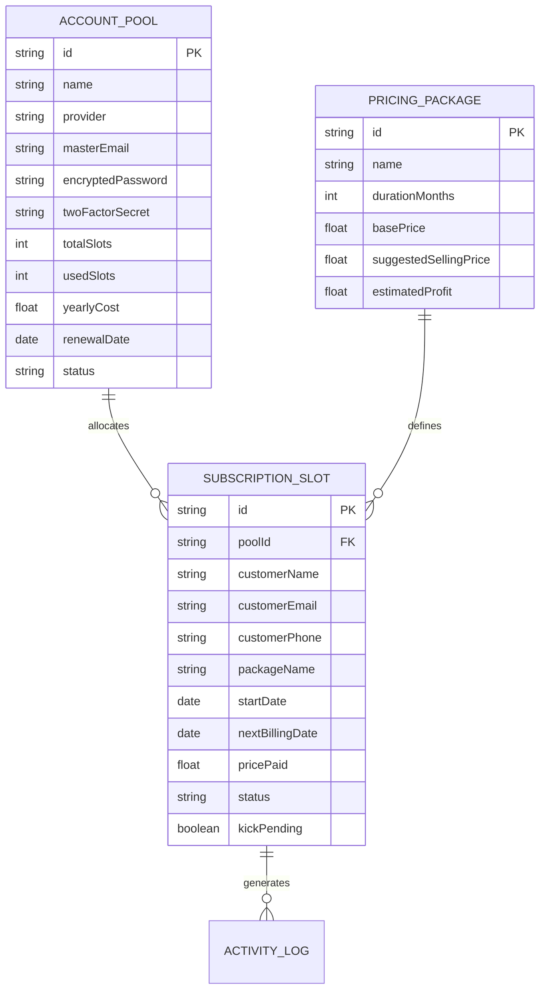
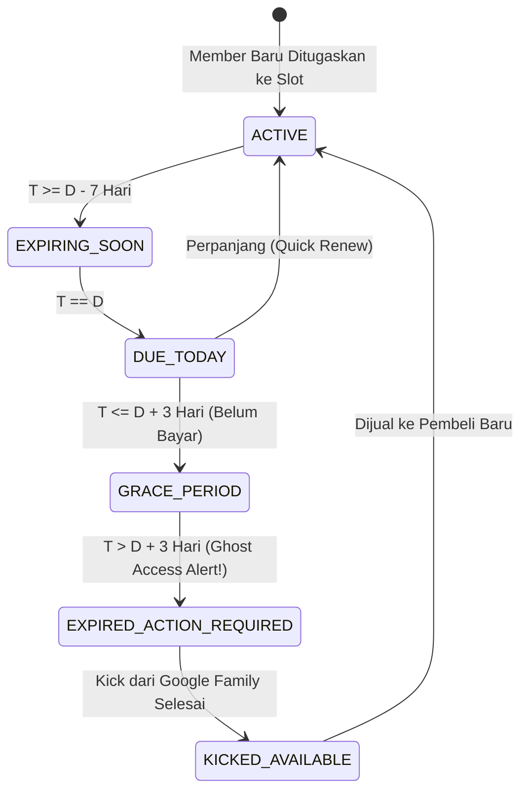
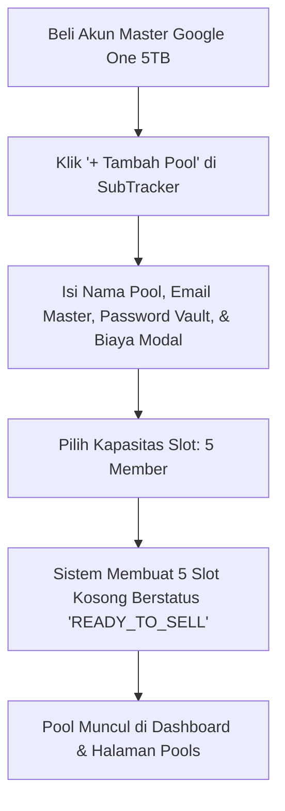
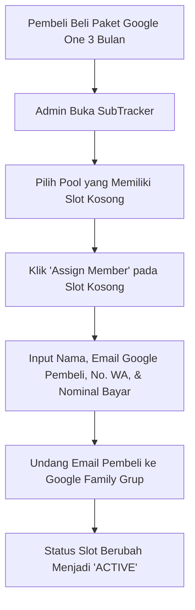
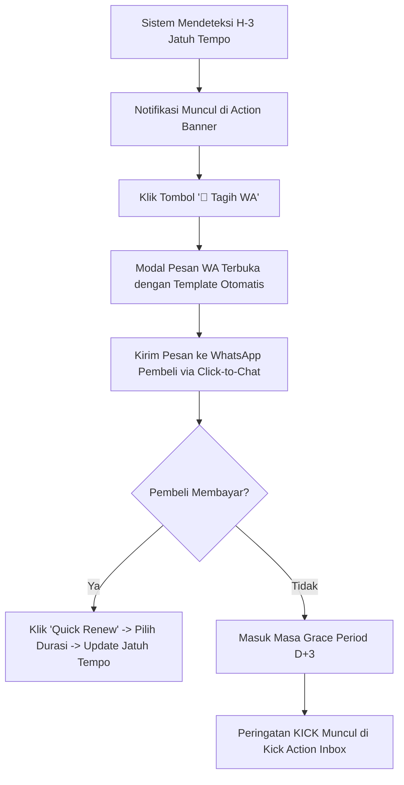

# 📘 PRODUCT REQUIREMENTS DOCUMENT (PRD)
# Google One Pro & SubTracker Command Center
### *Sistem Operasi & Manajemen Bisnis Multi-Seat Family Sharing Reseller*

---

| Dokumen | Nilai |
| :--- | :--- |
| **Versi Produk** | v1.2.0-Production |
| **Status** | Approved & Production Baseline |
| **Target Platform** | Web App (Desktop Responsive & Mobile Viewport 375px) |
| **Teknologi Utama** | Next.js 16 (App Router), React 19, TypeScript 5, Tailwind CSS v4, Dexie.js (IndexedDB), Supabase |

---

## 1. Executive Summary & Problem Statement

### 1.1 Latar Belakang Bisnis
Bisnis reseller langganan digital menggunakan model **Multi-Seat Account Pooling** (misalnya Google One Family 2TB/5TB, Canva Team, Adobe Creative Cloud, Spotify Family, dan AI Workspaces). Dalam model ini:
1. Reseller membeli **1 Akun Induk (Master)** dengan biaya tahunan/bulanan tetap.
2. Kapasitas akun dipecah menjadi beberapa **Slot Member** (contoh: 1 Master + 5 Member pada Google One Family) yang dijual secara eceran dengan paket 1 Bulan, 3 Bulan, atau 1 Tahun.

### 1.2 Masalah Kritis Pengelolaan Manual (Spreadsheet):
* **Ghost Access (Kebocoran Storage):** Member yang telah habis masa berlakunya tetap menikmati storage cloud 5TB karena admin lupa mengeluarkan (*kick*) akun mereka dari Google Family.
* **Keterlambatan Penagihan (Billing Leakage):** Tagihan dikirim mendadak pada hari H atau telat, mengakibatkan *churn* dan pembeli enggan memperpanjang.
* **Kekacauan Matematika Modal vs Laba:** Kesulitan membagi modal akun master yang dibayar tahunan dengan pemasukan member yang bervariasi siklusnya.
* **Keamanan Kredensial:** Lupa email/password akun master saat hendak menambahkan member baru.

### 1.3 Nilai Solusi SubTracker
SubTracker berfungsi sebagai **Command Center Terintegrasi** yang mengotomatisasi pengawasan slot, penagihan terjadwal via WhatsApp, audit pengeluaran akun master, serta SOP *zero-leakage kick checklist*.

---

## 2. Arsitektur Data & Model Relasional



### 2.1 State Machine Transisi Member & Slot
Setiap slot member dihitung statusnya secara otomatis oleh `state-engine.ts` berdasarkan perbandingan hari ini ($T$) dengan tanggal jatuh tempo ($D$):



---

## 3. Diagram Alur Pengguna (End-to-End User Flows)

### Flow 1: Pengadaan Akun Master & Setup Pool


### Flow 2: Alokasi Pembeli Baru ke Slot


### Flow 3: Penagihan & Perpanjangan Rutin


---

## 4. Spesifikasi Halaman per Halaman (Page-by-Page Requirements)

---

### 📄 HALAMAN 1: ADMIN OVERVIEW (DASHBOARD UTAMA)
*Path Navigasi:* `activeTab: 'dashboard'`

#### 1. Tujuan Halaman
Memberikan pandangan tingkat tinggi (360 derajat) atas kesehatan operasional bisnis, pendapatan bulanan (MRR), slot kosong siap jual, dan ancaman kebocoran akses.

#### 2. Komponen & Elemen Antarmuka:
1. **Action Inbox Alert Banner (Danger State):**
   - Muncul di paling atas jika ada member yang berstatus `EXPIRED` atau `GRACE_PERIOD`.
   - Menampilkan counter: *"X Member Perlu Ditindak Segera"*.
   - Tombol CTA: *"Tindak Sekarang"* (otomatis navigasi ke Kick Action Inbox).
2. **4 KPI Metrics Summary Cards:**
   - **Monthly Recurring Revenue (MRR):** Total omset bulanan ternormalisasi (`Rp XX.XXX.XXX`) + tren % dibanding bulan lalu.
   - **Active Member Counter:** Total member aktif + utilitas slot terisi (`X/Y Slot`).
   - **Slot Kosong Siap Jual:** Indikator ketersediaan inventori yang bisa segera diiklankan ke pembeli baru.
   - **Estimasi Laba Bersih:** Total pemasukan dikurangi modal prorata akun master.
3. **Active Family Pools Preview:**
   - Visualisasi kartu setiap pool akun induk.
   - Progress bar kapasitas slot (hijau jika penuh, kuning/oranye jika ada slot kosong).
   - Akses cepat membuka detail pool.
4. **Upcoming Renewals List (Jatuh Tempo Mendekat):**
   - Daftar member H-7 s/d H-1.
   - Dilengkapi tombol cepat WhatsApp **`💬 Tagih WA`** untuk menagih dalam 1 klik.
5. **Expense vs Revenue Chart:**
   - Grafik batang/lingkaran pembagian kategori layanan (Google One, Canva, Netflix, Adobe).
6. **Recent Activity Feed:**
   - Audit trail 5 aktivitas terakhir (member ditambahkan, diperpanjang, atau di-kick).

#### 3. Tampilan Mobile (Viewport 375px):
- Kartu KPI ditata dalam 2 kolom grid ringkas.
- Banner alert dijadikan compact banner dengan teks tegas.
- Bottom Navigation Bar tetap mengambang (*fixed glassmorphic bottom nav*).

---

### 📄 HALAMAN 2: POOLS & GROUPS MANAGEMENT
*Path Navigasi:* `activeTab: 'pools'`

#### 1. Tujuan Halaman
Mengelola seluruh akun induk (master accounts), mengamankan kredensial login dan kode 2FA, serta mengalokasikan slot anggota keluarga.

#### 2. Komponen & Elemen Antarmuka:
1. **Header Toolbar:**
   - Tombol utama **`+ Tambah Pool Baru`**.
   - Filter provider: *All, Google One, Canva, Adobe, Lainnya*.
   - Search bar pencarian berdasarkan nama pool atau email master.
2. **Pool Detail Card (Master Card):**
   - **Header Card:** Nama Pool (misal: `G-One 5TB Pool #01`), Provider logo, Status badge (`ACTIVE`, `NEED_RENEWAL`).
   - **Credential Vault (Aman):**
     - Email Master: `master.acc01@gmail.com` + tombol Copy.
     - Password Masked: `••••••••••••` + tombol reveal/copy.
     - 2FA Recovery Key / Backup Notes.
   - **Slot Capacity Progress Bar:** Menampilkan visualisasi slot terisi (misal: 5 dari 5 terisi, atau 4 terisi + 1 kosong).
   - **Finansial Pool:**
     - Modal Akun Induk: `Rp 70.000 / thn`.
     - Total Pemasukan Terkumpul dari Pool ini: `Rp 380.000`.
     - Net Profit Pool: `+Rp 310.000`.
   - **Slot Member Badges:** Menampilkan inisial avatar dari masing-masing member yang mengisi slot.
3. **Aksi Pool:**
   - Edit Pool, Hapus Pool, dan Export Rekap Slot Pool.

---

### 📄 HALAMAN 3: KICK ACTION INBOX (ZERO-GHOST ACCESS)
*Path Navigasi:* `activeTab: 'action_inbox'`

#### 1. Tujuan Halaman
Pusat eksekusi admin untuk menghapus (*kick*) member yang sudah kadaluwarsa dari Google Family sharing, memastikan tidak ada satupun pengguna gratisan yang membebani kuota penyimpanan.

#### 2. Komponen & Elemen Antarmuka:
1. **Urgency Banner:**
   - Label penegasan: *"Setiap member yang belum di-kick di halaman ini masih menikmati akses Google One Anda secara gratis!"*.
2. **Action List Table / Cards:**
   - Nama Member & Email Google.
   - Pool Akun Induk asal member tersebut.
   - Hari Kadaluwarsa: *"Expired 2 hari yang lalu"*.
   - No. WhatsApp Member.
3. **Action Triggers:**
   - **Tombol `KICK SEKARANG` (Merah):** Membuka modal panduan checklist SOP (Buka Google Family link -> Hapus member -> Centang konfirmasi).
   - **Tombol `Beri Toleransi (+1 Hari)`:** Memberikan perpanjangan darurat grace period.
   - **Tombol `Hubungi Terakhir Kali (WA)`:** Mengirim pesan peringatan final sebelum akses dicabut permanen.

---

### 📄 HALAMAN 4: MEMBER SLOTS (ALL SUBSCRIPTIONS)
*Path Navigasi:* `activeTab: 'all_subscriptions'`

#### 1. Tujuan Halaman
Katalog dan basis data seluruh pelanggan/member yang terdaftar di seluruh pool akun.

#### 2. Komponen & Elemen Antarmuka:
1. **Search & Filter Controls:**
   - Input pencarian: Cari nama, email, no WhatsApp, atau ID slot.
   - Filter Status: `ALL`, `ACTIVE`, `EXPIRING_SOON`, `GRACE_PERIOD`, `EXPIRED`.
   - Filter Pool: Filter berdasarkan pool spesifik.
   - Switch View: Tombol toggle tampilan **Grid Cards** vs **Data Table**.
2. **Tampilan Data Table:**
   - Kolom: Pelanggan (Nama + Email), Pool Asal, Paket (1/3/12 Bln), Jatuh Tempo, Status, Nominal Bayar, Aksi.
3. **Tampilan Grid Cards:**
   - Kartu individual member dengan badge status dinamis dan countdown hari jatuh tempo.
4. **Tombol Tindakan Cepat per Baris/Kartu:**
   - `Quick Renew` (Perpanjang langsung).
   - `Chat WhatsApp` (Kirim pesan WA).
   - `Edit Data` (Ubah email/paket).
   - `Hapus/Kosongkan Slot`.

---

### 📄 HALAMAN 5: PRICE LIST & KATALOG PAKET
*Path Navigasi:* `activeTab: 'pricelist'`

#### 1. Tujuan Halaman
Mengatur standarisasi harga jual, kalkulasi margin laba kotor, dan membuat teks promosi yang siap di-copy ke media sosial / chat pelanggan.

#### 2. Komponen & Elemen Antarmuka:
1. **Katalog Paket Kartu:**
   - Paket 1 Bulan (Harga Modal Prorata: `Rp 5.800`, Harga Jual: `Rp 25.000`, Margin: `76%`).
   - Paket 3 Bulan (Harga Modal: `Rp 17.500`, Harga Jual: `Rp 65.000`, Margin: `73%`).
   - Paket 1 Tahun (Harga Modal: `Rp 70.000`, Harga Jual: `Rp 180.000`, Margin: `61%`).
2. **Kalkulator Unit Economics Interaktif:**
   - Input harga beli akun master tahunan.
   - Slider penentuan harga jual per member.
   - Estimasi laba bersih jika 5 slot terisi penuh.
3. **Generator Teks Broadcast Promosi:**
   - Tombol *"Salin Format Price List WhatsApp"*.

---

### 📄 HALAMAN 6: FINANCIAL ANALYTICS & UNIT ECONOMICS
*Path Navigasi:* `activeTab: 'analytics'`

#### 1. Tujuan Halaman
Menyajikan laporan keuangan analitis mendalam mengenai kesehatan bisnis reseller langganan digital.

#### 2. Komponen & Elemen Antarmuka:
1. **Financial Summary Cards:**
   - Total Gross Revenue (Omset Kumulatif).
   - Total Master Account Costs (Total Modal Akun Induk).
   - Net Profit (Laba Bersih Riil).
   - Rata-rata Margin Laba Kotor (% Profitability).
2. **Grafik Trend Arus Kas Bulanan:**
   - Grafik garis pendapatan vs pengeluaran modal per bulan.
3. **Analisis Payback Period & Break-Even Per Pool:**
   - Status BEP: Berapa member yang dibutuhkan agar 1 pool akun induk balik modal (biasanya slot ke-2 sudah menutup modal tahunan).
4. **Tingkat Retensi & Churn Rate:**
   - Persentase member yang memperpanjang vs member yang berhenti.

---

### 📄 HALAMAN 7: AUDIT ACTIVITY LOGS
*Path Navigasi:* `activeTab: 'activity_logs'`

#### 1. Tujuan Halaman
Menyimpan riwayat kronologis seluruh tindakan yang dilakukan pada sistem demi transparansi, pencegahan kelalaian admin, dan audit jejak digital.

#### 2. Komponen & Elemen Antarmuka:
- Timeline aktivitas dengan cap waktu presisi (*timestamp*).
- Kategori log: `MEMBER_ADDED`, `RENEWAL_COMPLETED`, `MEMBER_KICKED`, `POOL_CREATED`, `PRICE_UPDATED`.
- Filter log berdasarkan tipe aksi dan rentang tanggal.

---

## 5. Spesifikasi Modals, Drawers & Interactivity

| No | Nama Komponen Modal / Drawer | Fungsi & Fitur Utama |
| :--- | :--- | :--- |
| 1 | **`AddEditSubscriptionModal`** | Form tambah/edit member: Input nama, email Google, No. WA, pemilihan pool, durasi paket (1/3/6/12 bln), nominal bayar, tanggal mulai & jatuh tempo otomatis. |
| 2 | **`AddEditPoolModal`** | Form tambah/edit akun master: Provider, email induk, password vault, kapasitas slot (default: 5), biaya tahunan, tanggal langganan master. |
| 3 | **`ActionChecklistModal`** | Panduan SOP Kick 3 Langkah: (1) Buka link Google Family admin, (2) Hapus akses email member, (3) Konfirmasi hapus di SubTracker untuk membebaskan slot jadi kosong. |
| 4 | **`QuickRenewModal`** | Perpanjangan 1 klik: Pilih durasi perpanjangan (otomatis menambah tanggal jatuh tempo dari tanggal expired sebelumnya) dan catat pembayaran baru. |
| 5 | **`WhatsAppMessageModal`** | Generator pesan otomatis dengan pilihan template: *Tagihan H-3*, *Hari H*, *Peringatan Grace Period*, dan *Pemberitahuan Akun Telah Di-kick*. Lengkap dengan deep link `https://wa.me/...`. |
| 6 | **`NotificationCenterDrawer`** | Panel samping daftar lonceng notifikasi real-time untuk seluruh event sistem. |
| 7 | **`ExportImportModal`** | Backup data instan format JSON dan CSV untuk menjaga keamanan data tanpa risiko kehilangan. |
| 8 | **`GoogleCalendarSyncModal`** | Ekspor agenda jadwal penagihan ke file kalender `.ics` atau sinkronisasi Google Calendar. |

---

## 6. Spesifikasi Desain Mobile View (Figma Alignment)

Sesuai dengan blueprint desain vektor di [`public/subtracker-mobile-figma.svg`](file:///d:/Dokumen/02_Kerja_Profesional/Google%20One%20Pro/public/subtracker-mobile-figma.svg):

```
┌──────────────────────────────────────────────────────────┐
│  09:41              [ Dynamic Island ]          📶 🔋    │
│  [GO Avatar] Google One Pro Command Center         [🔔 3]│
├──────────────────────────────────────────────────────────┤
│  ⚠️  3 Member Perlu Ditindak                  [ Tindak ] │
├──────────────────────────────────────────────────────────┤
│  ┌──────────────────────┐    ┌──────────────────────┐    │
│  │ Est. Omset / Bln     │    │ Member Aktif         │    │
│  │ Rp 4.250.000 (+12%)  │    │ 48 Member (10 Pool)  │    │
│  └──────────────────────┘    └──────────────────────┘    │
├──────────────────────────────────────────────────────────┤
│  FAMILY SHARING POOLS                         Lihat Semua│
│  ┌────────────────────────────────────────────────────┐  │
│  │ ☁️ G-One Pool #01 (5TB)                 [FULL 5/5] │  │
│  │ [====================================] 5/5 Terisi  │  │
│  └────────────────────────────────────────────────────┘  │
│  ┌────────────────────────────────────────────────────┐  │
│  │ ⚡ G-One Pool #02 (2TB)               [SISA 1 SLOT] │  │
│  │ [============================.......] 4/5 Terisi  │  │
│  └────────────────────────────────────────────────────┘  │
├──────────────────────────────────────────────────────────┤
│  JATUH TEMPO MENDEKAT (H-3)                              │
│  👤 Andi Prasetyo (Exp: 12 Sept)          [💬 Tagih WA]  │
├──────────────────────────────────────────────────────────┤
│  [ Home ]    [ Pools ]    ( + )    [ Member ]    [ Laba ]│
└──────────────────────────────────────────────────────────┘
```

### Aturan Responsivitas:
1. **Breakpoints:**
   - Mobile: `< 768px` (Gunakan layout 1 kolom, kartu berjarak padding 16px, Bottom Navigation melayang).
   - Desktop: `≥ 1024px` (Gunakan Sidebar kiri + Header atas + Grid multi-kolom).
2. **Touch Targets:** Seluruh tombol pada mobile memiliki ukuran minimal `44px × 44px` agar mudah ditekan jari.
3. **Glassmorphic Navigation Bar:** Navigasi bawah menggunakan `backdrop-blur-md bg-slate-900/90` dengan border tipis atas `border-slate-800`.
4. **FAB Tengah:** Tombol bundar `+` menonjol di tengah bilah navigasi bawah untuk menambahkan member atau pool baru secara instan.

---

## 7. Persyaratan Non-Fungsional (NFR) & Keamanan

1. **Local-First & Offline Resilience:** Aplikasi harus dapat dibuka dan berfungsi penuh secara offline menggunakan basis data lokal Dexie (IndexedDB) dengan sinkronisasi opsional ke Supabase.
2. **Keamanan Kredensial:** Password akun induk di Vault disimpan secara terenkripsi dan hanya di-dekripsi saat admin menekan tombol buka/salin.
3. **Kecepatan Akses (Performance SLA):**
   - Largest Contentful Paint (LCP) < 1.2 detik.
   - Perpindahan antar tab instan tanpa reload halaman penuh (Client-side React 19 State).
4. **Integritas Data:** Penghapusan akun master tidak boleh menghapus histori transaksi member lama (*soft delete* atau relasi arsip).
