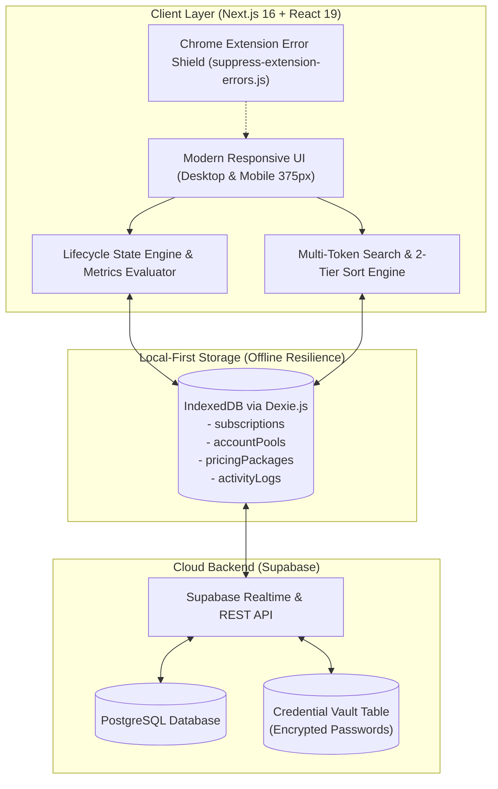

# 📘 PRODUCT REQUIREMENTS DOCUMENT (PRD)
# Google One Pro & SubTracker Command Center
### *Sistem Operasi, Keuangan & Manajemen Bisnis Multi-Seat Family Sharing Reseller*

---

| Dokumen | Nilai |
| :--- | :--- |
| **Versi Produk** | **v2.1.0-Production (Smart Inventory, Triple Guards, Anti-Collision UI & Multi-Sort Engine)** |
| **Status** | Approved & Production Baseline |
| **Target Platform** | Web App (Desktop Responsive & Mobile Viewport 375px PWA Ready) |
| **Tech Stack Utama** | Next.js 16 (App Router + Turbopack), React 19, TypeScript 5, Tailwind CSS v4, Dexie.js (IndexedDB Local-First), Supabase PostgreSQL |
| **Repositori Dokumen** | `docs/` |

---

## 📑 Indeks Modul Spesifikasi Dokumen Terkait

Dokumentasi lengkap SubTracker dibagi menjadi 6 modul dokumen terspesialisasi:

1. **[PRD Utama (Dokumen Ini)](file:///d:/Dokumen/02_Kerja_Profesional/Google%20One%20Pro/docs/PRD_SUBTRACKER_COMMAND_CENTER.md)**: Executive summary, arsitektur sistem, peta navigasi, dan rekapitulasi fitur end-to-end.
2. **[Spesifikasi Manajemen Pool & Siklus Hidup Member](file:///d:/Dokumen/02_Kerja_Profesional/Google%20One%20Pro/docs/SPEC_POOL_AND_MEMBER_LIFECYCLE.md)**: State engine, dual-tier pool (Garansi vs Lepas), auto-nonaktif pool expired, SOP kick, riwayat mantan member (soft-kick archive), dan modul pindah pool.
3. **[Spesifikasi Pencarian Cerdas, Sorting & Desain Interaksi](file:///d:/Dokumen/02_Kerja_Profesional/Google%20One%20Pro/docs/SPEC_SEARCH_SORT_AND_UX.md)**: Mesin pencarian multi-token (No WA, email, notes, deep pool search), sorting 2-lapis (akun expired otomatis di bawah), header tabel interaktif, dan mobile responsive design (375px).
4. **[Spesifikasi Katalog Harga Dinamis & Analitik Finansial](file:///d:/Dokumen/02_Kerja_Profesional/Google%20One%20Pro/docs/SPEC_PRICING_AND_FINANCIALS.md)**: Database-driven packages (Primary vs Secondary email), pendaftaran 1-klik dari paket, kalkulator unit economics, MRR, payback period BEP, dan generator broadcast WA.
5. **[Spesifikasi Keamanan Data, Kredensial Vault & Sinkronisasi Cloud](file:///d:/Dokumen/02_Kerja_Profesional/Google%20One%20Pro/docs/SPEC_DATA_SECURITY_AND_SYNC.md)**: Arsitektur Local-First (Dexie.js), Credential Vault terenkripsi, Supabase Real-time Sync, pencegahan error ekstensi browser (`suppress-extension-errors.js`), serta backup export/import & iCalendar sync.
6. **[PRD & Manual Integrasi AI Agent (Hermes & Bot)](file:///d:/Dokumen/02_Kerja_Profesional/Google%20One%20Pro/docs/PRD_AI_AGENT_SYSTEM_DIRECTIVES.md)**: Pedoman mesin, aturan akuntansi kas terkunci (never-reset profit), triple guards (in-flight lock, duplicate check, capacity cap), data dictionary Supabase, kueri SQL baku, dan SOP triase otomatis untuk AI Agent.

---

## 1. Executive Summary & Problem Statement

### 1.1 Latar Belakang Bisnis
Bisnis reseller langganan digital multi-seat (seperti **Google One Family 2TB/5TB**, Canva Team, Google Workspace, Adobe Creative Cloud, dan AI Tools) beroperasi dengan prinsip **Account Pooling Arbitrage**:
1. Reseller membeli **1 Akun Induk (Master)** dengan komitmen tahunan atau kuartalan bernilai grosir.
2. Kapasitas kursi dipecah menjadi beberapa **Slot Member** (contoh: 1 Master + 5 Member pada Google One Family) yang dijual secara eceran dengan paket 1, 2, 3, 6, atau 12 bulan.

### 1.2 Masalah Kritis Pengelolaan Manual (Spreadsheet):
* **Ghost Access (Kebocoran Storage):** Member yang telah habis masa berlakunya tetap menikmati storage cloud 5TB karena admin lupa mengeluarkan (*kick*) akun mereka dari Google Family Console.
* **Akun Expired Menumpuk & Mengaburkan Data:** Admin kesulitan melihat mana member yang benar-benar aktif karena baris member yang sudah habis masa aktifnya bercampur di posisi atas tabel.
* **Pencarian Data Gagal (Search Misses):** Kesulitan mencari akun saat pelanggan menghubungi via nomor WhatsApp baru, bukti transfer, atau catatan transaksi.
* **Kekhawatiran Data Hilang Saat Di-kick:** Admin ragu menghapus member dari dashboard karena takut kehilangan kontak pelanggan dan riwayat transaksi untuk follow-up penawaran perpanjangan.
* **Kekacauan Alokasi Antar Pool:** Saat akun master akan expired, admin kesulitan memindahkan member yang masih berlangganan ke akun induk lain yang masih panjang masa aktifnya tanpa input ulang data manual.
* **Keamanan Kredensial:** Kredensial login akun master tercecer di notes atau chat, rawan lupa password atau salah input saat mengundang member baru.

### 1.3 Nilai Solusi SubTracker Command Center
SubTracker berfungsi sebagai **Sistem Operasi Reseller Terpadu** yang menghadirkan:
- **Zero Ghost Access**: Banner peringatan otomatis dan SOP checklist kick berjenjang.
- **Smart 2-Tier Sorting**: Akun expired otomatis ditaruh di bawah sendiri, akun aktif selalu di atas.
- **Robust Multi-Token Search**: Pencarian cerdas mencakup nomor WhatsApp, email, catatan, nomor slot, hingga deep member search di dalam pool.
- **Soft-Kick Preservation & Pindah Pool**: Data member yang di-kick tetap tersimpan utuh di arsip drawer pool dan dapat dipindahkan ke pool lain dengan 1 klik.
- **Triple-Guard Data Safety**: Proteksi *in-flight submission lock*, cegah duplikasi email aktif di pool yang sama, dan batas keras kapasitas 5 slot per pool.
- **Anti-Collision 2-Row Card UI**: Tata letak kartu langganan terstruktur dengan menu `•••` di pojok kanan atas dan action footer $\le 230$px tanpa tombol tumpeng tindih atau meluber.
- **Dual-Tier Inventory Intelligence**: Klasifikasi pool otomatis antara akun garansi perpanjangan ($\ge 180$ hari) dan akun lepas ($< 180$ hari), serta auto-nonaktif akun expired.
- **Credential Vault**: Penyimpanan kredensial akun master yang aman dan terisolasi.

---

## 2. Arsitektur Keseluruhan Sistem (High-Level Architecture)

---

## 3. Peta Navigasi & Fitur per Tab

| No | Tab Navigasi | Rute Internal | Deskripsi & Nilai Operasional |
| :--- | :--- | :--- | :--- |
| 1 | **Dashboard Overview** | `activeTab: 'dashboard'` | Command center ringkas: 4 KPI Metrics, Banner Kick Action, Daftar Slot & Member Aktif (Grid/Table view dengan Sort Select), Upcoming Renewals, Donut Chart, dan Feed Aktivitas. |
| 2 | **Pools & Groups** | `activeTab: 'pools'` | Manajemen akun induk/master: Pantau kapasitas slot, masa aktif master, Credential Vault, filter tier (Garansi vs Lepas vs Expired), pencarian deep member, drawer riwayat mantan member, dan modal Pindah Pool. |
| 3 | **Kick Action Inbox** | `activeTab: 'action_inbox'` | Triage penanganan member yang telah jatuh tempo: Checklist SOP kick 3 langkah, quick renew, pindah pool, dan tombol broadcast WA tagihan. |
| 4 | **All Subscriptions** | `activeTab: 'all_subscriptions'` | Katalog lengkap seluruh member: Filter kategori layanan, filter status, sort dropdown (Expired di bawah), clickable table headers, dan opsi edit/hapus. |
| 5 | **Price List Catalog** | `activeTab: 'pricelist'` | Katalog harga database-driven: Manajemen paket langganan (Akun Utama vs Sekunder), kalkulasi margin laba, pendaftaran 1-klik, dan salin format broadcast WA. |
| 6 | **Financial Analytics** | `activeTab: 'analytics'` | Laporan unit economics mendalam: Omset kumulatif, modal akun master tahunan prorata, laba bersih, titik impas (BEP) per pool, dan analisis retensi. |
| 7 | **Audit Activity Logs** | `activeTab: 'activity_logs'` | Rekaman kronologis audit trail atas setiap aksi sistem (member dibuat, diedit, diperpanjang, dipindah pool, atau di-kick). |

---

## 4. Matriks Ringkasan Fitur Unggulan

| Fitur Utama | Solusi yang Diimplementasikan | Detail Dokumen |
| :--- | :--- | :--- |
| **Auto-Demote Expired Accounts** | Akun kadaluarsa (`TERMINATED` / sisa hari $< 0$) otomatis ditempatkan di bagian paling bawah pada semua mode sort, dilengkapi baris pemisah visual. | [SPEC_SEARCH_SORT_AND_UX.md](file:///d:/Dokumen/02_Kerja_Profesional/Google%20One%20Pro/docs/SPEC_SEARCH_SORT_AND_UX.md) |
| **Comprehensive Search Engine** | Pencarian multi-token mendukung nama, nomor WhatsApp (`0812` $\leftrightarrow$ `+62 812`), email, catatan internal, nama pool, dan nomor slot. | [SPEC_SEARCH_SORT_AND_UX.md](file:///d:/Dokumen/02_Kerja_Profesional/Google%20One%20Pro/docs/SPEC_SEARCH_SORT_AND_UX.md) |
| **Deep Search di Pools** | Mengetik nama/email/no WA member di tab Pools langsung menampilkan pool tempat member tersebut berada. | [SPEC_SEARCH_SORT_AND_UX.md](file:///d:/Dokumen/02_Kerja_Profesional/Google%20One%20Pro/docs/SPEC_SEARCH_SORT_AND_UX.md) |
| **Soft-Kick Preservation** | Member yang di-kick tidak dihapus; tersimpan di tab "Riwayat Mantan Member" pool dengan opsi 1-klik Re-alokasi atau Aktifkan Kembali. | [SPEC_POOL_AND_MEMBER_LIFECYCLE.md](file:///d:/Dokumen/02_Kerja_Profesional/Google%20One%20Pro/docs/SPEC_POOL_AND_MEMBER_LIFECYCLE.md) |
| **Fitur Pindah Pool** | Memindahkan member aktif/kicked dari satu akun induk ke akun induk lain secara instan dengan penyesuaian masa aktif fleksibel. | [SPEC_POOL_AND_MEMBER_LIFECYCLE.md](file:///d:/Dokumen/02_Kerja_Profesional/Google%20One%20Pro/docs/SPEC_POOL_AND_MEMBER_LIFECYCLE.md) |
| **Dual-Tier Inventory Intelligence** | Klasifikasi pool otomatis: Garansi Perpanjang ($\ge 180$ hari), Khusus Akun Lepas ($< 180$ hari), dan Auto-Nonaktif Akun Expired. | [SPEC_POOL_AND_MEMBER_LIFECYCLE.md](file:///d:/Dokumen/02_Kerja_Profesional/Google%20One%20Pro/docs/SPEC_POOL_AND_MEMBER_LIFECYCLE.md) |
| **Database-Driven Price List** | Admin dapat menambah, mengedit paket harga, menentukan flag Akun Utama/Sekunder, dan 1-klik daftarkan member langsung dari paket. | [SPEC_PRICING_AND_FINANCIALS.md](file:///d:/Dokumen/02_Kerja_Profesional/Google%20One%20Pro/docs/SPEC_PRICING_AND_FINANCIALS.md) |
| **Credential Vault & Cloud Sync** | Password akun master tersimpan aman, sinkronisasi dua arah real-time antara IndexedDB lokal dan Supabase PostgreSQL. | [SPEC_DATA_SECURITY_AND_SYNC.md](file:///d:/Dokumen/02_Kerja_Profesional/Google%20One%20Pro/docs/SPEC_DATA_SECURITY_AND_SYNC.md) |
| **Extension Isolation Shield** | Proteksi dari crash eksternal akibat ekstensi browser (`M_ID` TypeError) menggunakan script pencegat sebelum render. | [SPEC_DATA_SECURITY_AND_SYNC.md](file:///d:/Dokumen/02_Kerja_Profesional/Google%20One%20Pro/docs/SPEC_DATA_SECURITY_AND_SYNC.md) |
| **Locked Cash & Profit Engine** | Uang kas yang pernah dibayarkan member (`price > 0`) terkunci permanen di ledger omset & laba bersih, tidak pernah ter-reset saat member expired/di-kick atau pool mati. | [SPEC_PRICING_AND_FINANCIALS.md](file:///d:/Dokumen/02_Kerja_Profesional/Google%20One%20Pro/docs/SPEC_PRICING_AND_FINANCIALS.md) |
| **AI Agent Directives & Rules** | Instruksi mesin baku untuk AI Agent (Hermes / Bot) guna mencegah halusinasi data, standardisasi kueri SQL, dan triase penagihan otomatis. | [PRD_AI_AGENT_SYSTEM_DIRECTIVES.md](file:///d:/Dokumen/02_Kerja_Profesional/Google%20One%20Pro/docs/PRD_AI_AGENT_SYSTEM_DIRECTIVES.md) |

---

## 5. Persyaratan Non-Fungsional (NFR) & Standar Kualitas

1. **Kehandalan Local-First (Offline-Ready):** Seluruh data tersimpan secara lokal di Dexie.js (IndexedDB). Aplikasi dapat beroperasi penuh tanpa koneksi internet, dan secara otomatis menyinkronkan data saat terhubung ke cloud Supabase.
2. **Performa Responsif & Rendah Latensi:**
   - Transisi antar tab berlangsung instan ($< 50$ ms) tanpa full-page reload.
   - First Contentful Paint (FCP) $< 0.8$ detik dan LCP $< 1.2$ detik.
   - Pembangkitan halaman statis optimal Next.js Turbopack (`Static Prerendered`).
3. **Keamanan & Perlindungan Privasi:**
   - Password akun induk di-mask secara default dengan opsi toggle reveal dan copy-to-clipboard.
   - Fitur tombol sensor privasi modal (*Privacy Eye Toggle*) untuk menyembunyikan angka modal akun induk saat layar dilihat orang lain.
4. **Resiliensi Terhadap Lingkungan Runtime:**
   - Dilengkapi interceptor event error (`suppress-extension-errors.js`) untuk menangkap error yang diinjeksikan oleh ekstensi browser pihak ketiga tanpa menghentikan eksekusi aplikasi.
