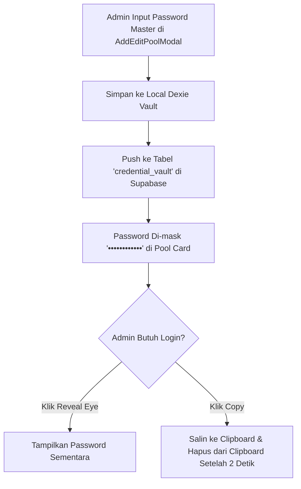

# 🔐 SPESIFIKASI: KEAMANAN DATA, KREDENSIAL VAULT & SINKRONISASI CLOUD
### *SubTracker Command Center — Modul Local-First, Supabase Sync & Extension Shield*

---

## 1. Arsitektur Hybrid Local-First (Dexie.js + Supabase)

SubTracker dirancang dengan filosofi **Local-First Resilience**. Aplikasi tidak boleh macet atau kehilangan akses ketika jaringan internet terputus, namun tetap dapat berkolaborasi antar perangkat melalui sinkronisasi cloud real-time.

```mermaid
flowchart LR
    subgraph Browser ["Local Browser Runtime"]
        App["SubTracker Next.js 16 Client"]
        DexieDB[("IndexedDB via Dexie.js\n- Subscriptions\n- Pools\n- Packages\n- ActivityLogs")]
    end

    subgraph SupabaseCloud ["Supabase PostgreSQL Cloud"]
        SupaAPI["Supabase REST API & WebSockets"]
        CloudDB[("PostgreSQL Tables\n- subscriptions\n- account_pools\n- pricing_packages\n- activity_logs\n- credential_vault")]
    end

    App <-->|Read / Write Instan (0ms)| DexieDB
    DexieDB <-->|Sync Bi-directional| SupaAPI
    SupaAPI <--> CloudDB
```

### 1.1 Status Sinkronisasi di Navbar (`CloudSyncStatus`)
Bilah atas (Navbar) menampilkan indikator status cloud yang dinamis:
- 🟢 **`synced` (Tersinkronisasi ke Cloud):** Menampilkan badge hijau berdenyut (*pulsing green dot*) yang menandakan database lokal sama persis dengan cloud Supabase.
- 🔵 **`syncing` (Sedang Menyinkronkan):** Menandakan proses push/pull data sedang berlangsung di latar belakang.
- ⚫ **`offline` (Mode Offline):** Koneksi internet terputus; aplikasi beralih 100% menggunakan cache lokal IndexedDB tanpa gangguan.
- 🟠 **`unconfigured` (Supabase Belum Dikonfigurasi):** Kredensial Supabase di `.env.local` belum diisi; aplikasi tetap berjalan penuh secara lokal.

### 1.2 Sinkronisasi Multi-Device Real-Time
Melalui fungsi `subscribeToCloudChanges` di `src/lib/supabase-service.ts`, ketika admin memperbarui member di laptop, layar aplikasi di HP admin lain akan otomatis memuat ulang (*hot-refresh*) tanpa perlu me-reload halaman browser.

---

## 2. Keamanan Credential Vault

Akun induk (*master accounts*) adalah aset paling berharga dalam bisnis reseller. SubTracker menerapkan modul **Credential Vault** untuk mengamankan kredensial login akun master.



### 2.1 Fitur Perlindungan Kredensial:
1. **Masking Berlapis:** Password tidak pernah ditampilkan dalam teks biasa (*plain-text*) secara terbuka pada kartu pool.
2. **One-Click Copy & Auto-Clear:** Admin dapat menyalin password tanpa melihat teksnya.
3. **Penyensoran Finansial Modal (Privacy Eye Toggle):** Tombol sensor mata di filter bar halaman Pools memungkinkan admin menyembunyikan nominal biaya modal akun induk jika layar sedang ditunjukkan kepada pelanggan atau karyawan.

---

## 3. Chrome Extension Error Isolation Shield

### 3.1 Latar Belakang Masalah Ekstensi Browser
Banyak ekstensi browser (ekstensi autofill password, adblocker, screenshot tools, atau color picker) menginjeksi script pihak ketiga ke dalam halaman web. Beberapa ekstensi yang memiliki bug melemparkan error seperti:
```
TypeError: Cannot read properties of undefined (reading 'M_ID')
at chrome-extension://eppiocemhmnlbhjplcgkofciiegomcon/executors/200.js
```
Pada aplikasi React/Next.js standar, error yang tidak tertangani ini dapat memicu React Error Boundary atau menampilkan Dev Overlay merah yang mengganggu operasional admin.

### 3.2 Solusi: `public/suppress-extension-errors.js`
SubTracker menerapkan **Security & Error Isolation Shield** yang dimuat sebelum skrip aplikasi lainnya melalui `src/app/layout.tsx`:

```tsx
<Script
  src="/suppress-extension-errors.js"
  strategy="beforeInteractive"
/>
```

Fitur Proteksi Skrip:
1. **Fase Capture Interception:** Mendengarkan event `error` dan `unhandledrejection` pada fase capture (`useCapture: true`) sebelum mencapai window handlers lainnya.
2. **Filtering Selektif:** Mengidentifikasi stack trace yang berasal dari `chrome-extension://`, `moz-extension://`, atau memuat keyword seperti `'M_ID'` dan `'bis_skin_checked'`.
3. **Stop Immediate Propagation:** Mencegah error ekstensi tersebut menyebar ke React runtime.
4. **Dev Overlay Neutralizer:** Secara otomatis mendeteksi dan menghapus tag `<nextjs-portal>` jika error tersebut dipicu oleh ekstensi pihak ketiga.

---

## 4. Pencadangan Data (Export/Import) & Sinkronisasi Kalender

### 4.1 Ekspor & Impor Cadangan (`ExportImportModal.tsx`)
- **Format JSON Lengkap:** Mencakup seluruh tabel: `subscriptions`, `accountPools`, `pricingPackages`, dan `activityLogs`.
- **Format CSV Spreadsheet:** Diformat khusus agar dapat dibuka di Microsoft Excel atau Google Sheets untuk keperluan pembukuan akuntansi offline.
- **Validasi Impor:** Memeriksa struktur file sebelum memuat data ke dalam IndexedDB untuk mencegah kerusakan data.

### 4.2 Integrasi Google Calendar & iCalendar (`GoogleCalendarSyncModal.tsx`)
- **Ekspor Format `.ics`:** Menghasilkan file kalender standar yang dapat diimpor langsung ke Apple Calendar, Microsoft Outlook, atau Google Calendar.
- **One-Click Google Calendar Link:** Pada setiap baris member di tabel langganan, terdapat ikon kalender yang langsung membuka antarmuka penambahan jadwal Google Calendar dengan pengingat H-3 dan deskripsi tagihan otomatis.
