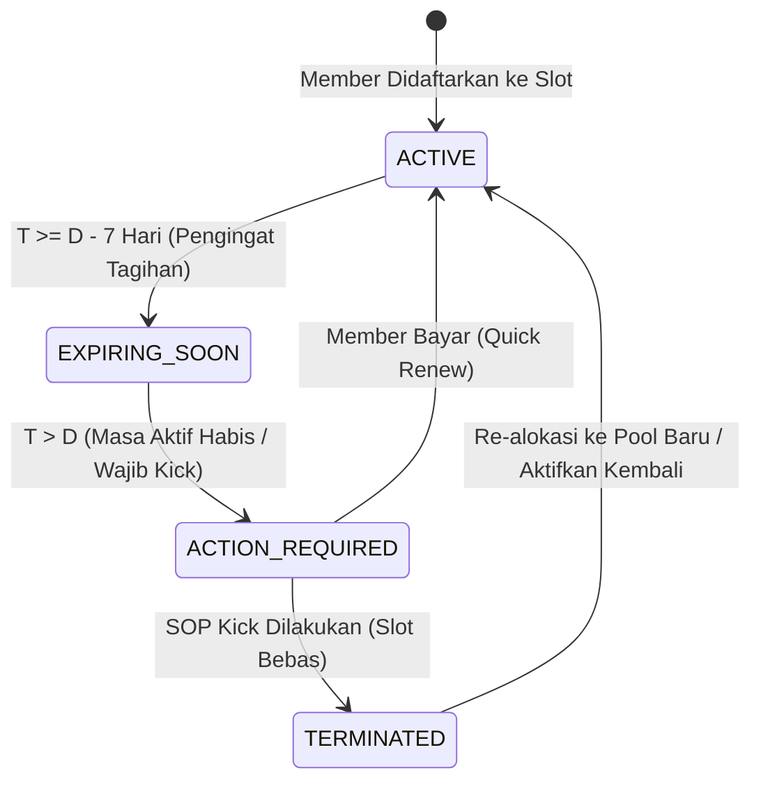
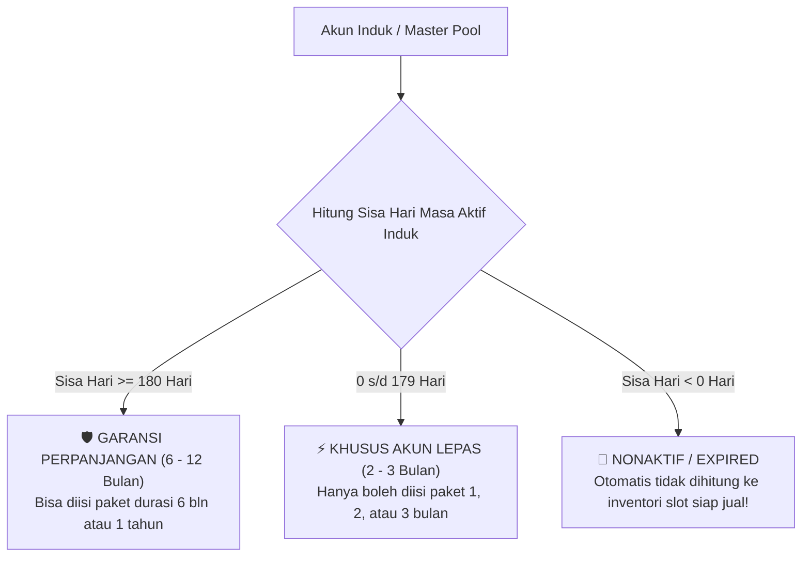
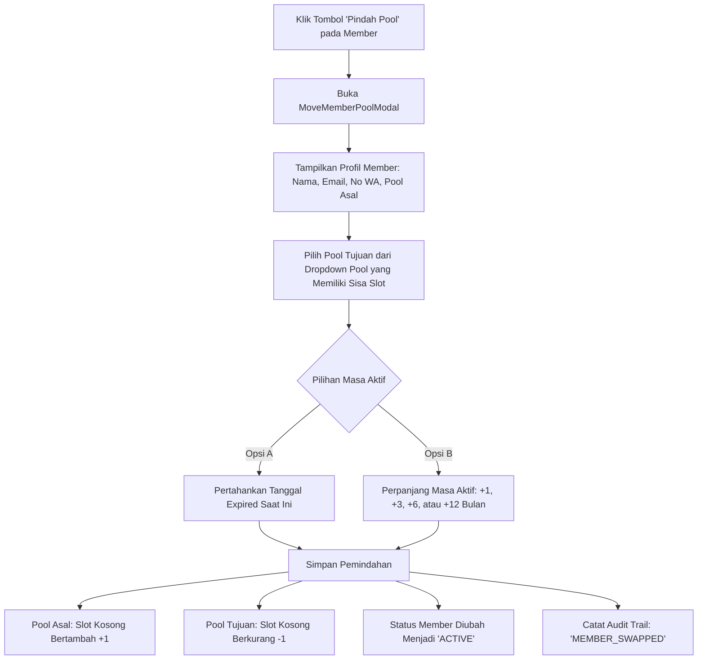

# 🔄 SPESIFIKASI: MANAJEMEN POOL & SIKLUS HIDUP MEMBER
### *SubTracker Command Center — Modul Lifecycle, Dual-Tier Inventory & Soft-Kick*

---

## 1. State Engine & Siklus Hidup Member

Setiap slot member dihitung statusnya secara otomatis oleh `src/lib/lifecycle/state-engine.ts` berdasarkan perbandingan tanggal hari ini ($T$) dengan tanggal jatuh tempo member ($D$):



### 1.1 Definisi Status Member (`SubscriptionStatus`)
| Status | Definisi & Syarat Waktu | Dampak pada Kapasitas Slot | Indikator Visual |
| :--- | :--- | :--- | :--- |
| `ACTIVE` | Member aktif normal ($T < D - 7$ hari). Akses cloud valid dan tagihan lunas. | Menempati 1 slot terisi pada pool. | Badge Hijau (`Normal Active`) |
| `EXPIRING_SOON` | Mendekati jatuh tempo ($D - 7 \le T \le D$). Waktunya mengirim WhatsApp tagihan. | Menempati 1 slot terisi pada pool. | Badge Oranye (`H-7 s/d H-1`) |
| `ACTION_REQUIRED` | Lewat jatuh tempo ($T > D$) dan belum ada pembayaran. Ghost access aktif! | Menempati 1 slot terisi (memblokir pembeli baru). | Badge Merah (`Wajib Kick`) |
| `TERMINATED` | Member telah dikeluarkan dari Google Family via SOP checklist kick. | **0 slot** (slot pool otomatis bertambah 1 kosong). | Badge Abu-abu (`Sudah Di-kick`) |

---

## 2. Dual-Tier Pool Inventory Intelligence

Untuk mencegah admin menjual paket durasi panjang pada akun master yang masa berlakunya tinggal sebentar, sistem menerapkan klasifikasi tier akun induk otomatis di `src/lib/utils.ts` (`getPoolTierInfo`):



### 2.1 Spesifikasi Tier Akun Induk
1. **Tier Garansi Perpanjang (`LONG_TERM_GUARANTEED`):**
   - **Kriteria:** Sisa masa aktif akun induk $\ge 180$ hari.
   - **Tujuan Operasional:** Pool aman untuk menjual paket komitmen panjang (6 bulan hingga 1 tahun) dengan garansi full tanpa risiko akun induk mati di tengah jalan.
   - **Label UI:** Badge Hijau Zamrud *"🛡️ Garansi Perpanjang (6-12 Bln)"*.
2. **Tier Khusus Akun Lepas (`SHORT_TERM_LEPAS`):**
   - **Kriteria:** Sisa masa aktif akun induk antara 1 hingga 179 hari.
   - **Tujuan Operasional:** Khusus dialokasikan untuk pelanggan yang membeli paket 1 bulan atau 3 bulan sekali bayar tanpa janji perpanjangan panjang pada pool yang sama.
   - **Label UI:** Badge Kuning Amber *"⚡ Khusus Akun Lepas (2-3 Bln)"*.
3. **Auto-Nonaktif Pool Expired (`EXPIRED_INACTIVE`):**
   - **Kriteria:** Sisa masa aktif akun induk $< 0$ hari.
   - **Perlindungan Otomatis:**
     - Seluruh sisa slot kosong di pool ini **otomatis tidak dihitung** ke dalam counter KPI *"Slot Aktif Siap Jual"* di dashboard.
     - Mencegah admin secara tidak sengaja mengalokasikan pelanggan baru ke akun master yang sudah mati.
     - Kartu pool diberi penanda border merah dan badge *"Akun Induk Nonaktif / Expired"*.

---

## 3. Arsitektur Soft-Kick Member Preservation

### 3.1 Masalah Operasional yang Diselesaikan
Sebelumnya, admin sering ragu melakukan kick member di dashboard karena khawatir data kontak pelanggan (No WA, histori paket, tanggal expired) terhapus. Akibatnya, slot di dashboard tetap tercatat "penuh", padahal pembeli baru ingin masuk.

### 3.2 Solusi: Soft-Kick Archive
Saat admin menyelesaikan SOP checklist kick pada member:
1. Data member **TIDAK PERNAH DIHAPUS** dari database IndexedDB maupun cloud Supabase.
2. Status member berubah menjadi `TERMINATED`, dengan penambahan timestamp `terminatedAt`.
3. Slot aktif pada pool otomatis dibebaskan sehingga kapasitas slot kosong bertambah $+1$.
4. Pada kartu pool (`PoolCard.tsx`), drawer daftar member menyediakan 2 tab terpisah:
   - **Tab 1: Member Aktif ($X$ Member):** Menampilkan member yang sedang aktif menggunakan slot.
   - **Tab 2: Riwayat / Mantan Member ($Z$ Member):** Menampilkan seluruh member yang pernah berada di pool ini dan telah di-kick.

```
┌─────────────────────────────────────────────────────────────┐
│ 👥 Anggota Keluarga & Alokasi Slot                          │
│ [ Member Aktif (3/5) ]      [ Riwayat / Mantan Member (2) ] │
├─────────────────────────────────────────────────────────────┤
│ 👤 Budi Santoso (budi@gmail.com)                            │
│    Masa Aktif: Expired 10 Sept 2026 • Status: Sudah Di-kick │
│    [ 🔄 Pindah / Alokasikan ke Pool Baru ]   [ 💬 Hubungi WA]│
└─────────────────────────────────────────────────────────────┘
```

### 3.3 Aksi Cepat pada Mantan Member:
- **"Pindah / Alokasikan ke Pool Baru"**: Membuka modal `MoveMemberPoolModal` dengan nama, email, dan no WA yang terisi otomatis.
- **"Aktifkan Kembali di Pool Ini"**: Jika pool lama masih ada slot kosong dan pelanggan melakukan pembayaran susulan.
- **"Kirim WhatsApp Follow-Up"**: Menghubungi pelanggan dengan penawaran promo perpanjangan.

---

## 4. Fitur Pindah Pool Antar Akun Induk (`MoveMemberPoolModal`)

Fitur ini memungkinkan admin memindahkan member dari satu akun master ke akun master lain secara instan tanpa perlu memasukkan data ulang secara manual.

### 4.1 Skenario Penggunaan Utama:
1. **Rebalancing Slot:** Pool A penuh dan akun induknya tinggal 20 hari lagi, sedangkan Pool B baru diperpanjang 1 tahun dan masih memiliki 2 slot kosong. Member dari Pool A dapat dipindahkan ke Pool B.
2. **Upgrade Layanan:** Member pindah dari paket Google One 2TB ke Google One 5TB pada pool berbeda.
3. **Penyelamatan Member Expired:** Member lama yang sempat di-kick ingin berlangganan kembali, admin langsung menempatkannya di pool yang masih fresh.

### 4.2 Alur Logika Pemindahan:

