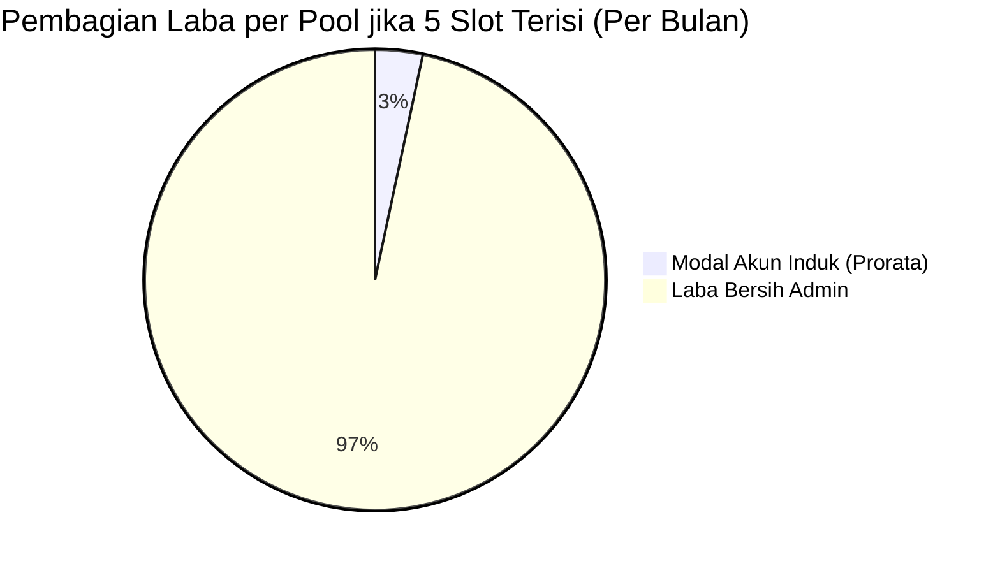

# 💰 SPESIFIKASI: KATALOG HARGA DINAMIS & ANALITIK FINANSIAL
### *SubTracker Command Center — Modul Pricing Package, Unit Economics & Revenue Engine*

---

## 1. Arsitektur Katalog Paket Harga Dinamis (`pricing_packages`)

Sebelumnya, daftar paket langganan bersifat statis (*hardcoded*). SubTracker telah mengadopsi model katalog harga **Database-Driven** yang tersimpan di IndexedDB (`pricingPackages`) dan tersinkronisasi ke cloud Supabase (`pricing_packages`).

### 1.1 Skema Data Paket (`PricingPackage`)
```typescript
export interface PricingPackage {
  id: string;
  name: string;                         // Contoh: "Google One 3 Bulan Family"
  accountType: 'PRIMARY_EMAIL' | 'SECONDARY_EMAIL'; // Tipe Akun Pembeli
  durationMonths: number;                // 1, 2, 3, 6, 12 Bulan
  billingCycle: 'monthly' | 'quarterly' | 'semi_annual' | 'yearly';
  price: number;                        // Harga jual (IDR)
  badge?: string;                       // Contoh: "⭐ Paling Laris & Rekomendasi"
  badgeColor?: string;                  // emerald, amber, blue, rose
  isPopular?: boolean;                  // Highlight kartu di UI
  isActive: boolean;                    // Tampilkan di katalog atau nonaktifkan
  description?: string;                 // Detail penjelasan paket
  features: string[];                   // Daftar poin fitur / benefit
  sortOrder: number;                    // Urutan tampilan paket
  createdAt: string;
  updatedAt: string;
}
```

### 1.2 Pembedaan: Akun Utama vs Akun Sekunder
| Jenis Akun | Nilai Konfigurasi | Deskripsi & Alur Operasional |
| :--- | :--- | :--- |
| **Akun Utama (Primary Email)** | `'PRIMARY_EMAIL'` | Admin mengirim undangan (*invite link*) langsung ke email Google pribadi milik pembeli. Pembeli tidak perlu berganti akun atau login ulang di perangkat mereka. Nilai jual lebih tinggi. |
| **Akun Sekunder (Secondary Email)** | `'SECONDARY_EMAIL'` | Admin meminjamkan akun Google siap pakai yang sudah berada di dalam Google Family sharing. Pembeli login menggunakan email dan password sekunder yang disediakan. |

### 1.3 Alur Pendaftaran 1-Klik dari Paket (`handleEnrollFromPackage`)
Pada kartu paket di tab **Price List**, terdapat tombol **`+ Daftarkan Member dari Paket Ini`**. 
Ketika ditekan:
1. Sistem otomatis membuka modal `AddEditSubscriptionModal`.
2. Bidang data terisi secara otomatis:
   - Nama Layanan: Terisi sesuai nama paket.
   - Siklus Penagihan: Terisi otomatis (`quarterly`, `semi_annual`, dsb.).
   - Nominal Harga: Terisi sesuai harga jual paket.
   - Tanggal Jatuh Tempo: Dihitung otomatis dari hari ini ditambah `durationMonths * 30 hari`.
   - Catatan: Menampung deskripsi paket dan tipe akun (Utama / Sekunder).
3. Admin hanya perlu menginput nama pembeli, email Google, dan nomor WhatsApp.

---

## 2. Kalkulator Unit Economics & Titik Impas (BEP)

Model bisnis pooling Google One Family memiliki rasio *margin of safety* yang sangat tinggi:

```
Asumsi: 1 Akun Master Google One 5TB
Kapasitas: 1 Master + 5 Member
Modal Beli Akun Master: Rp 70.000 / tahun (atau ~Rp 5.833 / bulan)
Harga Jual Eceran per Slot: Rp 35.000 / bulan
```



### 2.1 Analisis Payback Period per Pool
- **Bulan ke-1:**
  - 1 Slot Terjual = Pendapatan `Rp 35.000` (Sudah menutup 50% modal tahunan master).
  - 2 Slot Terjual = Pendapatan `Rp 70.000` (**100% Titik Impas / BEP Tercapai!** Modal tahunan akun master sudah tertutup lunas hanya dari 2 slot di bulan pertama).
  - Slot ke-3, 4, dan 5 serta bulan ke-2 hingga bulan ke-12 adalah **MURNI 100% LABA BERSIH RESELLER**.

### 2.2 Metrik Finansial pada Tab Analytics (`FinancialAnalyticsView.tsx`)
1. **Total Kas Masuk (Realized Gross Revenue):** Akumulasi seluruh uang kas yang telah dibayarkan oleh pembeli slot (`price > 0`), mencakup member aktif maupun mantan member (soft-kicked/terminated). Uang kas riil yang sudah diterima di muka tidak pernah di-reset atau dikurangi saat member dilepas dari grup keluarga.
   $$\text{Total Kas Masuk} = \sum_{s \in \text{Seluruh Member}} \text{Price}(s) = \text{Kas Member Aktif} + \text{Kas Mantan Member}$$
2. **Monthly Recurring Revenue (MRR):** Total omset bulanan ternormalisasi yang dihitung khusus dari member yang saat ini aktif berslot (`status !== 'TERMINATED'`).
   $$\text{MRR} = \sum_{s \in \text{Member Aktif}} \frac{\text{Price}(s)}{\text{DurationMonths}(s)}$$
3. **Total Laba Bersih Riil (Realized Net Profit):**
   $$\text{Laba Bersih Riil} = \text{Total Kas Masuk} - \text{Total Modal Seluruh Master Pool (COGS)}$$
4. **Gross Profit Margin (%):**
   $$\text{Margin} = \frac{\text{Laba Bersih Riil}}{\text{Total Kas Masuk}} \times 100\%$$
5. **Tingkat Retensi (Renewal Rate):** Rasio member yang memperpanjang langganan dibandingkan member yang berhenti.

---

### 2.3 Prinsip Penguncian Kas Masuk & Integritas Laba (Locked Profit Engine)

Berdasarkan audit operasional per 12 September 2026, sistem menerapkan **Prinsip Akuntansi Kas (Cash-Basis Integrity)** yang mengikat:

1. **Uang Masuk Tidak Boleh Ter-Reset (No Revenue Reset):**
   - Ketika akun master pool expired atau member mencapai tanggal jatuh tempo, admin melakukan *soft-kick* (status menjadi `TERMINATED`) untuk mengosongkan slot.
   - Status `TERMINATED` **hanya melepaskan alokasi slot aktif dan mengecualikan member dari perhitungan MRR berjalan**, namun nilai iuran (`price`) **tetap tersimpan dan terkunci** ke dalam `totalContractedRevenue`.
   - Hal ini mencegah anomali di mana COGS seluruh akun master (misal: 5 master = Rp 170.000) dibebankan penuh, namun omsetnya berkurang drastis karena member di-kick.
2. **Per-Pool Unit Economics Persistence:**
   - Setiap pool akun induk mencatat total kas riil yang pernah dihasilkan (`totalActualRevenue`) dari seluruh member yang pernah mengisi slot pool tersebut (baik member aktif maupun mantan member).
   - Akun master yang telah expired dan seluruh membernya telah di-kick **tetap berstatus surplus profit** di tab Analytics jika akumulasi uang masuk melebihi modal pembelian pool tersebut.
3. **Aturan Perpindahan Member Antar-Pool (Transfer & Renewal):**
   - **Opsi Pertahankan Masa Aktif (`keep_dates`):** Perpindahan darurat/rebalancing tidak memungut biaya baru. Omset awal tetap tercatat sebagai bagian dari kas masuk sistem.
   - **Opsi Perpanjangan Durasi (`renew`):** Menampilkan input *Nominal Kas Perpanjangan (IDR)*. Jika member membayar biaya baru, nominal tersebut dicatat sebagai transaksi kas masuk baru, dan riwayat perpindahan terdokumentasi di `activityLogs` (`MEMBER_SWAPPED`).

---

### 2.4 Panduan untuk AI Agent & Data Warehouse (Hermes / Holding Intelligence)

Untuk AI Agent (seperti **Hermes Agent** via Telegram atau script ETL Data Warehouse):

1. **Kueri Kas Masuk Total (Gross Revenue):**
   Saat Agent ditanya *"Berapa total omset/kas masuk SubTracker?"*, Agent dilarang memfilter `WHERE status = 'ACTIVE'` saja. Rumus kueri SQL yang benar adalah:
   ```sql
   SELECT SUM(price) AS total_realized_cash 
   FROM subscriptions 
   WHERE price > 0;
   ```
2. **Kueri Estimasi Run-Rate Bulanan (MRR):**
   Saat Agent ditanya *"Berapa omset bulanan/MRR SubTracker saat ini?"*, Agent wajib memfilter slot aktif:
   ```sql
   SELECT SUM(
     CASE 
       WHEN billing_cycle = 'yearly' THEN ROUND(price / 12)
       WHEN billing_cycle = 'quarterly' THEN ROUND(price / 3)
       WHEN billing_cycle = 'semi_annual' THEN ROUND(price / 6)
       ELSE price 
     END
   ) AS mrr_estimate 
   FROM subscriptions 
   WHERE status != 'TERMINATED';
   ```
3. **Kueri Laba Bersih Riil (Net Profit):**
   ```sql
   SELECT 
     (SELECT COALESCE(SUM(price), 0) FROM subscriptions WHERE price > 0) -
     (SELECT COALESCE(SUM(master_cost), 0) FROM pools) AS net_profit_realized;
   ```
4. **Validasi Baseline Data (Ground Truth 12 Sept 2026):**
   - Total Akun Master: **5 Pool** (Total Modal COGS: `Rp 170.000`).
   - Slot Member Aktif: **9 Slot** (Mamah Sasa, Sasadara Azma, Rafi Rauf, Dheva Navis, Donies Daily, Hero Farm, Fahru Hernan, Fahru Hernan 2, TernakOs).
   - Mantan Member Berbayar (Eks-Pool): **6 Member** (`Rey`, `Ardana`, `Jonathan Raymond`, `Farhan Firjatullah`, `Faqih Syaifulloh`, `Tio` @ Rp 70.000 = `Rp 420.000`).
   - **Total Kas Masuk Aktual:** `Rp 300.000` (aktif) + `Rp 420.000` (eks-pool) = **`Rp 720.000`**.
   - **Total Laba Bersih Riil:** `Rp 720.000 - Rp 170.000` = **`+Rp 550.000`** (Surplus Profit ~76%).

---

## 3. SOP Broadcast WhatsApp & Format Penagihan

### 3.1 Pilihan Template WhatsApp Otomatis (`WhatsAppMessageModal.tsx`)
Aplikasi menyediakan template pesan WhatsApp dengan parameter dinamis (`{memberName}`, `{packageName}`, `{endDate}`, `{price}`):

1. **Template H-3 Pengingat Jatuh Tempo:**
   > *"Halo kak {memberName}, masa aktif paket {packageName} kakak akan berakhir dalam 3 hari pada {endDate}. Untuk menjaga agar akses Google One 5TB tetap berjalan tanpa kendala, silakan lakukan perpanjangan sebesar {price} ke rekening berikut: BCA 1234567890 a.n Admin. Terima kasih!"*
2. **Template Hari H (Jatuh Tempo Hari Ini):**
   > *"Halo kak {memberName}, hari ini tanggal {endDate} adalah hari terakhir masa aktif Google One kakak. Mohon konfirmasi apakah ingin diperpanjang hari ini sebelum sistem melakukan pelepasan slot otomatis ya kak. Terima kasih!"*
3. **Template Pemberitahuan Akun Telah Di-kick (Grace Period Lewat):**
   > *"Halo kak {memberName}, karena masa tenggang pembayaran telah berakhir, akses Google One kakak di grup keluarga telah kami lepaskan. File kakak tetap aman di Google Drive. Jika ingin bergabung kembali, silakan hubungi kami untuk mendapatkan slot baru. Terima kasih banyak!"*

### 3.2 Generator Salin Format Price List
Pada halaman **Price List**, terdapat tombol **`📋 Salin Format WhatsApp`** yang menyusun daftar harga ke dalam teks siap kirim untuk broadcast chat atau story status.
