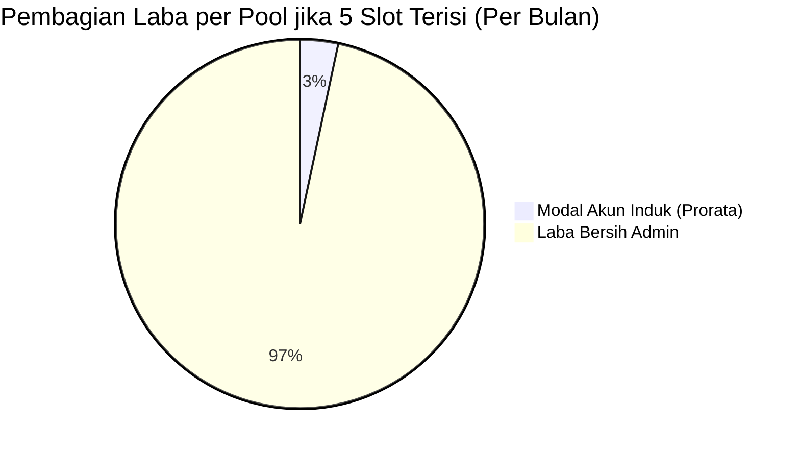

# 💰 SPESIFIKASI: KATALOG HARGA DINAMIS & ANALITIK FINANSIAL
### *SubTracker Command Center — Modul Pricing Package, Unit Economics & Revenue Engine*

---

## 1. Arsitektur Katalog Paket Harga Dinamis (`pricing_packages`)

Sebelumnya, daftar paket langganan bersifat statis (*hardcoded*). SubTracker telah mengadopsi model katalog harga **Database-Driven** yang tersimpan di IndexedDB (`pricingPackages`) dan tersinkronisasi ke cloud Supabase (`pricing_packages`).

### 1.1 Skema Data Paket (`PricingPackage`)
```typescript
export interface PricingPackage {
  id: string;
  name: string;                         // Contoh: "Google One 3 Bulan Family"
  accountType: 'PRIMARY_EMAIL' | 'SECONDARY_EMAIL'; // Tipe Akun Pembeli
  durationMonths: number;                // 1, 2, 3, 6, 12 Bulan
  billingCycle: 'monthly' | 'quarterly' | 'semi_annual' | 'yearly';
  price: number;                        // Harga jual (IDR)
  badge?: string;                       // Contoh: "⭐ Paling Laris & Rekomendasi"
  badgeColor?: string;                  // emerald, amber, blue, rose
  isPopular?: boolean;                  // Highlight kartu di UI
  isActive: boolean;                    // Tampilkan di katalog atau nonaktifkan
  description?: string;                 // Detail penjelasan paket
  features: string[];                   // Daftar poin fitur / benefit
  sortOrder: number;                    // Urutan tampilan paket
  createdAt: string;
  updatedAt: string;
}
```

### 1.2 Pembedaan: Akun Utama vs Akun Sekunder
| Jenis Akun | Nilai Konfigurasi | Deskripsi & Alur Operasional |
| :--- | :--- | :--- |
| **Akun Utama (Primary Email)** | `'PRIMARY_EMAIL'` | Admin mengirim undangan (*invite link*) langsung ke email Google pribadi milik pembeli. Pembeli tidak perlu berganti akun atau login ulang di perangkat mereka. Nilai jual lebih tinggi. |
| **Akun Sekunder (Secondary Email)** | `'SECONDARY_EMAIL'` | Admin meminjamkan akun Google siap pakai yang sudah berada di dalam Google Family sharing. Pembeli login menggunakan email dan password sekunder yang disediakan. |

### 1.3 Alur Pendaftaran 1-Klik dari Paket (`handleEnrollFromPackage`)
Pada kartu paket di tab **Price List**, terdapat tombol **`+ Daftarkan Member dari Paket Ini`**. 
Ketika ditekan:
1. Sistem otomatis membuka modal `AddEditSubscriptionModal`.
2. Bidang data terisi secara otomatis:
   - Nama Layanan: Terisi sesuai nama paket.
   - Siklus Penagihan: Terisi otomatis (`quarterly`, `semi_annual`, dsb.).
   - Nominal Harga: Terisi sesuai harga jual paket.
   - Tanggal Jatuh Tempo: Dihitung otomatis dari hari ini ditambah `durationMonths * 30 hari`.
   - Catatan: Menampung deskripsi paket dan tipe akun (Utama / Sekunder).
3. Admin hanya perlu menginput nama pembeli, email Google, dan nomor WhatsApp.

---

## 2. Kalkulator Unit Economics & Titik Impas (BEP)

Model bisnis pooling Google One Family memiliki rasio *margin of safety* yang sangat tinggi:

```
Asumsi: 1 Akun Master Google One 5TB
Kapasitas: 1 Master + 5 Member
Modal Beli Akun Master: Rp 70.000 / tahun (atau ~Rp 5.833 / bulan)
Harga Jual Eceran per Slot: Rp 35.000 / bulan
```



### 2.1 Analisis Payback Period per Pool
- **Bulan ke-1:**
  - 1 Slot Terjual = Pendapatan `Rp 35.000` (Sudah menutup 50% modal tahunan master).
  - 2 Slot Terjual = Pendapatan `Rp 70.000` (**100% Titik Impas / BEP Tercapai!** Modal tahunan akun master sudah tertutup lunas hanya dari 2 slot di bulan pertama).
  - Slot ke-3, 4, dan 5 serta bulan ke-2 hingga bulan ke-12 adalah **MURNI 100% LABA BERSIH RESELLER**.

### 2.2 Metrik Finansial pada Tab Analytics (`FinancialAnalyticsView.tsx`)
1. **Monthly Recurring Revenue (MRR):** Total omset bulanan ternormalisasi dari seluruh member aktif.
   $$\text{MRR} = \sum_{s \in \text{Member Aktif}} \frac{\text{Price}(s)}{\text{DurationMonths}(s)}$$
2. **Gross Profit Margin (%):**
   $$\text{Margin} = \frac{\text{Total Pendapatan} - \text{Total Modal Master}}{\text{Total Pendapatan}} \times 100\%$$
3. **Tingkat Retensi (Renewal Rate):** Rasio member yang memperpanjang langganan dibandingkan member yang berhenti.

---

## 3. SOP Broadcast WhatsApp & Format Penagihan

### 3.1 Pilihan Template WhatsApp Otomatis (`WhatsAppMessageModal.tsx`)
Aplikasi menyediakan template pesan WhatsApp dengan parameter dinamis (`{memberName}`, `{packageName}`, `{endDate}`, `{price}`):

1. **Template H-3 Pengingat Jatuh Tempo:**
   > *"Halo kak {memberName}, masa aktif paket {packageName} kakak akan berakhir dalam 3 hari pada {endDate}. Untuk menjaga agar akses Google One 5TB tetap berjalan tanpa kendala, silakan lakukan perpanjangan sebesar {price} ke rekening berikut: BCA 1234567890 a.n Admin. Terima kasih!"*
2. **Template Hari H (Jatuh Tempo Hari Ini):**
   > *"Halo kak {memberName}, hari ini tanggal {endDate} adalah hari terakhir masa aktif Google One kakak. Mohon konfirmasi apakah ingin diperpanjang hari ini sebelum sistem melakukan pelepasan slot otomatis ya kak. Terima kasih!"*
3. **Template Pemberitahuan Akun Telah Di-kick (Grace Period Lewat):**
   > *"Halo kak {memberName}, karena masa tenggang pembayaran telah berakhir, akses Google One kakak di grup keluarga telah kami lepaskan. File kakak tetap aman di Google Drive. Jika ingin bergabung kembali, silakan hubungi kami untuk mendapatkan slot baru. Terima kasih banyak!"*

### 3.2 Generator Salin Format Price List
Pada halaman **Price List**, terdapat tombol **`📋 Salin Format WhatsApp`** yang menyusun daftar harga ke dalam teks siap kirim untuk broadcast chat atau story status.
