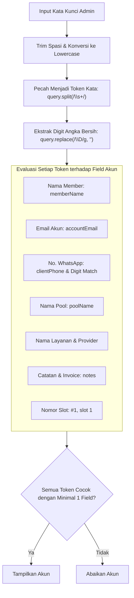
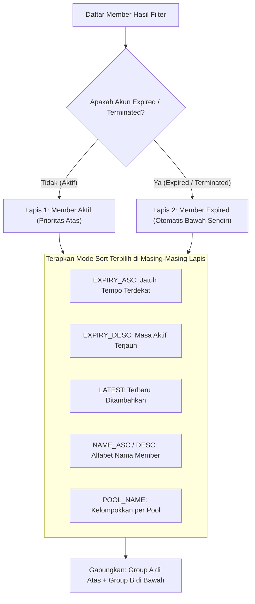

# 🔍 SPESIFIKASI: PENCARIAN CERDAS, SISTEM SORTING & DESAIN INTERAKSI
### *SubTracker Command Center — Modul Search Engine, 2-Tier Sorting & UI/UX*

---

## 1. Arsitektur Mesin Pencarian Multi-Token & Normalisasi

### 1.1 Akar Masalah Pencarian Konvensional (Search Misses)
Pada versi sebelumnya, pencarian seringkali tidak memunculkan akun yang dicari karena:
1. **Pencarian Single Field Exact Match:** Jika admin mengetik `"Google oren"` atau `"budi 5tb"`, pencarian gagal karena kata pertama berada pada judul layanan (`name`) dan kata kedua berada pada nama pool (`poolName`).
2. **Field Kunci Tidak Diperiksa:** Nomor WhatsApp/HP (`clientPhone`) dan catatan internal (`notes`) terlewat dari fungsi pencocokan.
3. **Format Nomor Telepon Berbeda:** Pencarian `"0812"` gagal mendeteksi nomor yang disimpan dalam format internasional `"+62 812-3456-7890"`.
4. **Sensitivitas Spasi:** Salinan teks yang mengandung spasi di awal atau akhir (`" husnidrsae "`) menggagalkan pencocokan `toLowerCase()`.
5. **Keterputusan di Tab Pools:** Input pencarian di Navbar tidak terhubung ke halaman Pools, dan filter di halaman Pools hanya memeriksa nama akun induk tanpa memeriksa member di dalamnya.

### 1.2 Solusi Mesin Pencarian Baru (`src/lib/searchSort.ts`)



### 1.3 Deep Search di Halaman Pools (`matchesPoolSearch`)
Sebuah kartu pool akan muncul di hasil pencarian jika:
- Nama pool, provider, email induk, atau catatan akun induk cocok dengan kata kunci, **ATAU**
- **Salah satu member** yang berada di dalam pool tersebut cocok dengan kata kunci pencarian (berdasarkan nama member, email, no WA, atau catatan).

---

## 2. Sistem Sorting 2-Lapis (Auto-Demote Expired Accounts)

Prinsip dasar pengurutan SubTracker adalah **Fokus pada Member Aktif Tanpa Kehilangan Data Riwayat**.



### 2.1 Pilihan Mode Sorting Member
| Kode Sort | Label Antarmuka | Perilaku Pengurutan |
| :--- | :--- | :--- |
| `EXPIRY_ASC` **(Default)** | 📅 **Jatuh Tempo Terdekat** | Member aktif yang paling dekat habis masa berlakunya berada di paling atas. Member expired otomatis di paling bawah. |
| `EXPIRY_DESC` | ⏳ **Masa Aktif Terjauh** | Member aktif dengan durasi sisa hari terbanyak berada di atas. Member expired di paling bawah. |
| `LATEST` | ✨ **Terbaru Ditambahkan (Latest)** | Member yang baru didaftarkan atau diupdate berada di paling atas. Member expired di paling bawah. |
| `NAME_ASC` | 🔤 **Nama Member (A - Z)** | Mengurutkan nama member secara alfabetis dari A ke Z. Member expired di bawah (juga A - Z). |
| `NAME_DESC` | 🔤 **Nama Member (Z - A)** | Mengurutkan nama member secara alfabetis dari Z ke A. Member expired di bawah. |
| `POOL_NAME` | 🏢 **Urutkan per Pool** | Mengelompokkan member berdasarkan nama Pool secara alfabetis, lalu berdasarkan nomor slot. Member expired di bawah. |

### 2.2 Separator Visual pada Tabel Member (`SubscriptionTable.tsx`)
Ketika tabel beralih dari daftar akun aktif ke akun expired yang ter-demote ke bawah, sistem secara otomatis merender baris pemisah visual:

```
┌────────────────────────────────────────────────────────────────────────────────────────┐
│  MEMBER & LAYANAN  │  POOL / SLOT  │  EMAIL AKUN  │  JATUH TEMPO  │  STATUS  │  BIAYA  │
├────────────────────────────────────────────────────────────────────────────────────────┤
│  👤 Andi Santoso   │  G-One Pool 1 │  andi@...    │  15/09/2026   │  ACTIVE  │ Rp 35rb │
│  👤 Cindy Claudia  │  G-One Pool 1 │  cindy@...   │  28/09/2026   │  ACTIVE  │ Rp 35rb │
├────────────────────────────────────────────────────────────────────────────────────────┤
│  🔴 AKUN EXPIRED / DI-KICK (2 Akun di Bawah)                                            │
│     Otomatis ditempatkan di bawah agar tidak mengganggu operasional akun aktif         │
├────────────────────────────────────────────────────────────────────────────────────────┤
│  👤 Dian Pratama   │  G-One Pool 1 │  dian@...    │  01/09/2026   │TERMINATED│ Rp 35rb │
└────────────────────────────────────────────────────────────────────────────────────────┘
```

### 2.3 Header Tabel Interaktif (Clickable Sort Headers)
Kolom tabel pada `SubscriptionTable.tsx` dapat diklik langsung:
- Klik **Member & Layanan**: Berganti antara `NAME_ASC` $\leftrightarrow$ `NAME_DESC` disertai indikator panah $\uparrow / \downarrow$.
- Klik **Pool / Slot**: Mengaktifkan pengelompokan `POOL_NAME`.
- Klik **Jatuh Tempo**: Berganti antara `EXPIRY_ASC` $\leftrightarrow$ `EXPIRY_DESC`.

---

## 3. Desain Interaksi & Spesifikasi Mobile View (375px Viewport)

### 3.1 Aturan Sentuh & Komponen Mobile:
1. **Target Sentuh Ergonomis:** Seluruh elemen interaktif (tombol, switch, opsi dropdown) memiliki ukuran area sentuh minimal **$44 \times 44$ pixel** sesuai standar Apple Human Interface Guidelines (HIG).
2. **Floating Glassmorphic Bottom Navigation:**
   - Bilah navigasi melayang di bagian bawah dengan efek blur kaca (`backdrop-blur-md bg-slate-900/90`).
   - Menyediakan 5 ikon akses utama: **Home**, **Pools**, **Tombol FAB (+) Tambah Member Cepat**, **Member**, dan **Laba/Finansial**.
3. **Responsive Grid to Single Column:**
   - Desktop: Tampilan 2 kolom grid dan tabel data lebar dengan horizontal scrollbar halus.
   - Mobile: Otomatis bertransformasi menjadi kartu ringkas vertikal (single column) dengan penekanan pada countdown sisa hari dan tombol cepat WhatsApp.
4. **Zero Native Popups:**
   - Seluruh konfirmasi kritis (Kick Member, Hapus Pool, dsb.) menggunakan komponen modal kustom `ConfirmationDialog` dengan animasi fade-in yang elegan tanpa dialog `window.confirm` bawaan browser.
